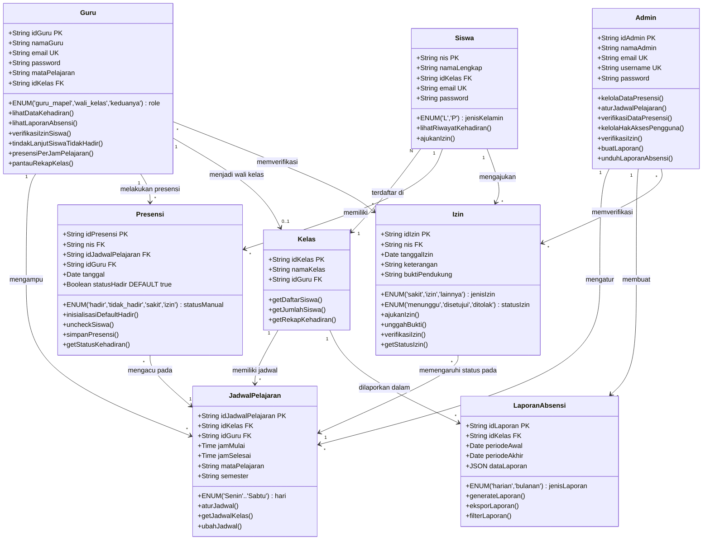

# Data Model

Document Version: v1.0
Project: Sipadu — Sistem Presensi Digital Siswa SMP N 4 Banguntapan
Product: Web-Based Attendance System
Status: Draft
Last Updated: 2026-07-16
Author: System Analyst AI
Source: Derived from srs.md (SoT-1)

---

## 1. Overview

This document defines the complete data model for Sipadu (Sistem Presensi Digital Siswa), a web-based attendance system for SMP N 4 Banguntapan. The model covers 8 entities: Siswa, Guru, Admin, Presensi, Izin, Kelas, JadwalPelajaran, and LaporanAbsensi. It specifies attributes, constraints, relationships, business rules, indexes, and structural DDL. All definitions are derived exclusively from srs.md (SoT-1). The current prototype uses localStorage; no permanent database storage is implemented in this phase.

---

## 2. Class Diagram



---

## 3. Entity Descriptions

### 3.1 Siswa

Menyimpan data siswa SMP N 4 Banguntapan. Siswa memiliki akun login (email) terbatas untuk mengajukan izin dan melihat riwayat kehadiran milik sendiri. Siswa tidak melakukan presensi mandiri. Tidak terdapat atribut barcode karena scan barcode tidak digunakan (Out-of-Scope Section 9, item 1).

| Attribute | Type | Constraint | Description |
| --- | --- | --- | --- |
| nis | VARCHAR(20) | PRIMARY KEY | Nomor Induk Siswa, identitas unik siswa (VR-01) |
| namaLengkap | VARCHAR(100) | NOT NULL | Nama lengkap siswa |
| jenisKelamin | VARCHAR(1) | NOT NULL, CHECK (jenisKelamin IN ('L','P')) | Jenis kelamin: L = Laki-laki, P = Perempuan |
| idKelas | VARCHAR(20) | FOREIGN KEY → Kelas.idKelas, NOT NULL | Referensi kelas tempat siswa terdaftar |
| email | VARCHAR(100) | UNIQUE, NOT NULL | Alamat email siswa, digunakan sebagai akun login (VR-09) |
| password | VARCHAR(255) | NOT NULL | Kata sandi akun siswa |

### 3.2 Guru

Menyimpan data guru yang dapat memiliki peran sebagai guru mapel, wali kelas, atau keduanya secara simultan. Guru mapel melakukan presensi per jam pelajaran; wali kelas memantau rekap kehadiran kelas binaan.

| Attribute | Type | Constraint | Description |
| --- | --- | --- | --- |
| idGuru | VARCHAR(20) | PRIMARY KEY | Kode unik identitas guru (VR-02) |
| namaGuru | VARCHAR(100) | NOT NULL | Nama lengkap guru |
| email | VARCHAR(100) | UNIQUE, NOT NULL | Alamat email untuk login (VR-09) |
| password | VARCHAR(255) | NOT NULL | Kata sandi akun guru |
| role | VARCHAR(20) | NOT NULL, CHECK (role IN ('guru_mapel','wali_kelas','keduanya')), DEFAULT 'guru_mapel' | Peran guru: guru_mapel (hanya mengajar), wali_kelas (hanya wali kelas, tidak mengajar), atau keduanya |
| mataPelajaran | VARCHAR(100) | NULL | Mata pelajaran yang diampu oleh guru (relevan jika role = guru_mapel atau keduanya) |
| idKelas | VARCHAR(20) | FOREIGN KEY → Kelas.idKelas, NULL | ID kelas binaan (relevan jika role = wali_kelas atau keduanya) |

### 3.3 Admin (Guru BK)

Menyimpan data admin yang merupakan Guru BK, bukan Admin TU (Out-of-Scope Section 9, item 12). Admin memiliki akses penuh terhadap seluruh fitur sistem.

| Attribute | Type | Constraint | Description |
| --- | --- | --- | --- |
| idAdmin | VARCHAR(20) | PRIMARY KEY | Kode unik identitas admin |
| namaAdmin | VARCHAR(100) | NOT NULL | Nama lengkap admin (Guru BK) |
| email | VARCHAR(100) | UNIQUE, NOT NULL | Alamat email admin untuk login (VR-09) |
| username | VARCHAR(50) | UNIQUE, NOT NULL | Nama pengguna admin |
| password | VARCHAR(255) | NOT NULL | Kata sandi admin |

### 3.4 Presensi

Menyimpan data transaksi presensi per jam pelajaran (bukan per hari check-in/check-out). Setiap record mewakili status kehadiran satu siswa pada satu jam pelajaran tertentu pada satu tanggal. Menggunakan mekanisme default-hadir: semua siswa otomatis ditandai Hadir (statusHadir = true) saat jam pelajaran dimulai, lalu guru memeriksa dan meng-uncheck siswa yang tidak hadir.

| Attribute | Type | Constraint | Description |
| --- | --- | --- | --- |
| idPresensi | VARCHAR(30) | PRIMARY KEY | Kode unik record presensi |
| nis | VARCHAR(20) | FOREIGN KEY → Siswa.nis, NOT NULL | Referensi siswa yang dipresensi |
| idJadwalPelajaran | VARCHAR(30) | FOREIGN KEY → JadwalPelajaran.idJadwalPelajaran, NOT NULL | Referensi jadwal jam pelajaran |
| idGuru | VARCHAR(20) | FOREIGN KEY → Guru.idGuru, NOT NULL | Referensi guru yang melakukan presensi |
| tanggal | DATE | NOT NULL | Tanggal presensi |
| statusHadir | BOOLEAN | NOT NULL, DEFAULT true | Status kehadiran: true = Hadir (default, tercentang), false = Tidak Hadir (setelah di-uncheck guru) |
| statusManual | VARCHAR(20) | NOT NULL, CHECK (statusManual IN ('hadir','tidak_hadir','sakit','izin')), DEFAULT 'hadir' | Status akhir yang tercatat; sakit/izin berasal dari izin yang disetujui dan di-override ke hadir pada rekap harian |

### 3.5 Izin

Menyimpan data pengajuan izin ketidakhadiran siswa. Satu izin berlaku untuk seluruh jam pelajaran pada tanggal yang diajukan (per day). Siswa mengajukan izin melalui akun login miliknya; wali kelas dan/atau admin memverifikasi status izin.

| Attribute | Type | Constraint | Description |
| --- | --- | --- | --- |
| idIzin | VARCHAR(30) | PRIMARY KEY | Kode unik pengajuan izin |
| nis | VARCHAR(20) | FOREIGN KEY → Siswa.nis, NOT NULL | Referensi siswa pengaju izin |
| tanggalIzin | DATE | NOT NULL | Tanggal ketidakhadiran yang diajukan (satu tanggal) |
| jenisIzin | VARCHAR(20) | NOT NULL, CHECK (jenisIzin IN ('sakit','izin','lainnya')) | Kategori izin: sakit (disertai bukti surat dokter), izin (keperluan diketahui sekolah), lainnya |
| keterangan | TEXT | NOT NULL | Deskripsi alasan ketidakhadiran |
| buktiPendukung | VARCHAR(255) | NULL | Path atau nama file bukti yang diunggah |
| statusIzin | VARCHAR(20) | NOT NULL, CHECK (statusIzin IN ('menunggu','disetujui','ditolak')), DEFAULT 'menunggu' | Status verifikasi izin |

### 3.6 Kelas

Menyimpan data kelas di SMP N 4 Banguntapan. Setiap kelas memiliki satu wali kelas dan menampung banyak siswa.

| Attribute | Type | Constraint | Description |
| --- | --- | --- | --- |
| idKelas | VARCHAR(20) | PRIMARY KEY | Kode unik kelas |
| namaKelas | VARCHAR(30) | NOT NULL | Nama kelas (contoh: VII A, VIII B) |
| idGuru | VARCHAR(20) | FOREIGN KEY → Guru.idGuru, NOT NULL | Referensi guru yang menjadi wali kelas |

### 3.7 JadwalPelajaran

Menggantikan konsep JadwalPresensi pada skema referensi (Out-of-Scope Section 9, item 11). Menyimpan jadwal jam pelajaran per kelas per hari, yang menjadi acuan sesi-sesi presensi. Satu record jadwal merepresentasikan satu jam pelajaran pada hari tertentu untuk kelas tertentu.

| Attribute | Type | Constraint | Description |
| --- | --- | --- | --- |
| idJadwalPelajaran | VARCHAR(30) | PRIMARY KEY | Kode unik jadwal pelajaran |
| idKelas | VARCHAR(20) | FOREIGN KEY → Kelas.idKelas, NOT NULL | Referensi kelas |
| idGuru | VARCHAR(20) | FOREIGN KEY → Guru.idGuru, NOT NULL | Referensi guru pengampu |
| hari | VARCHAR(10) | NOT NULL, CHECK (hari IN ('Senin','Selasa','Rabu','Kamis','Jumat','Sabtu')) | Hari pelaksanaan |
| jamMulai | TIME | NOT NULL | Waktu mulai jam pelajaran |
| jamSelesai | TIME | NOT NULL | Waktu selesai jam pelajaran |
| mataPelajaran | VARCHAR(100) | NOT NULL | Nama mata pelajaran |
| semester | VARCHAR(30) | NOT NULL | Semester berlaku (contoh: 2025/2026-Ganjil) |

### 3.8 LaporanAbsensi

Menyimpan data rekapitulasi kehadiran yang dihasilkan otomatis oleh sistem. Dua jenis laporan: harian (berbasis persentase threshold 60%) dan bulanan (per mata pelajaran sebagai acuan penilaian). Data laporan ditampilkan dalam format terstruktur dan dapat diunduh.

| Attribute | Type | Constraint | Description |
| --- | --- | --- | --- |
| idLaporan | VARCHAR(30) | PRIMARY KEY | Kode unik laporan |
| idKelas | VARCHAR(20) | FOREIGN KEY → Kelas.idKelas, NOT NULL | Referensi kelas yang dilaporkan |
| periodeAwal | DATE | NOT NULL | Tanggal awal periode laporan |
| periodeAkhir | DATE | NOT NULL | Tanggal akhir periode laporan |
| jenisLaporan | VARCHAR(10) | NOT NULL, CHECK (jenisLaporan IN ('harian','bulanan')) | Jenis laporan: harian (persentase) atau bulanan (per mata pelajaran) |
| dataLaporan | JSON | NOT NULL | Data rekapitulasi dalam format terstruktur |

---

## 4. Relationships

| Relationship | Type | Cardinality | Description |
| --- | --- | --- | --- |
| Siswa → Presensi | One-to-Many | 1:N | Satu siswa memiliki banyak record presensi (per jam pelajaran) |
| Siswa → Izin | One-to-Many | 1:N | Satu siswa dapat mengajukan banyak izin |
| Siswa → Kelas | Many-to-One | N:1 | Banyak siswa tergabung dalam satu kelas |
| Guru → JadwalPelajaran | One-to-Many | 1:N | Satu guru dapat mengampu banyak jadwal pelajaran |
| Guru (wali) → Kelas | One-to-Many | 1:1 | Satu guru (sebagai wali kelas) menjadi wali untuk satu kelas |
| Guru → Presensi | One-to-Many | 1:N | Satu guru dapat melakukan banyak record presensi |
| Guru ↔ Izin | Many-to-Many | M:N | Guru/wali kelas memverifikasi izin siswa |
| Admin → JadwalPelajaran | One-to-Many | 1:N | Admin mengatur jadwal pelajaran |
| Admin → LaporanAbsensi | One-to-Many | 1:N | Admin membuat dan mengunduh laporan |
| Admin ↔ Izin | Many-to-Many | M:N | Admin memverifikasi izin secara terpusat |
| Kelas → JadwalPelajaran | One-to-Many | 1:N | Satu kelas memiliki banyak jadwal pelajaran |
| Kelas → LaporanAbsensi | One-to-Many | 1:N | Laporan dibuat berdasarkan kelas |
| Presensi → JadwalPelajaran | Many-to-One | N:1 | Presensi mengacu pada jadwal pelajaran tertentu |
| Izin → JadwalPelajaran | Many-to-One | N:1 | Izin memengaruhi status kehadiran pada seluruh jadwal di tanggal tersebut |

---

## 5. Business Rules

### 5.1 Presensi Rules (BR-01 to BR-05)

- **BR-01 — Default Hadir:** Setiap kali sesi presensi untuk suatu jam pelajaran dimulai, sistem secara otomatis menandai semua siswa yang terdaftar di kelas tersebut sebagai Hadir (statusHadir = true, tercentang).
- **BR-02 — Uncheck oleh Guru Mapel:** Guru mapel yang mengajar pada jam tersebut wajib memeriksa kondisi kelas dan melepas centang (uncheck) hanya pada siswa yang benar-benar tidak hadir. Guru tidak perlu mencentang siswa yang hadir karena status hadir sudah menjadi default.
- **BR-03 — Presensi Per Jam Pelajaran:** Proses pada BR-01 dan BR-02 berulang setiap kali jam pelajaran berganti. Status kehadiran satu siswa dapat berbeda antar jam pelajaran dalam satu hari yang sama.
- **BR-04 — Akses Presensi Guru Mapel:** Guru mapel hanya dapat mengakses dan melakukan presensi pada kelas dan jam pelajaran yang diampunya (VR-06).
- **BR-05 — Verifikasi Admin:** Admin (Guru BK) dapat memverifikasi dan memperbaiki data presensi yang bermasalah jika terjadi kesalahan pencatatan (F-04).

### 5.2 Izin Rules (BR-06 to BR-11)

- **BR-06 — Izin Per Hari:** Satu pengajuan izin hanya untuk satu tanggal dan berlaku untuk seluruh jam pelajaran pada tanggal tersebut.
- **BR-07 — Kategori Izin:** Izin dikategorikan menjadi tiga jenis: sakit (disertai bukti surat dokter), izin (keperluan yang diketahui sekolah), dan lainnya (keperluan di luar kategori tersebut).
- **BR-08 — Bukti Pendukung:** Setiap pengajuan izin wajib menyertakan unggahan file bukti pendukung (misal: surat dokter untuk kategori sakit).
- **BR-09 — Status Izin:** Izin memiliki tiga status: menunggu (saat baru diajukan), disetujui (jika izin diterima), atau ditolak (jika izin tidak memenuhi ketentuan).
- **BR-10 — Verifikator Izin:** Izin diverifikasi oleh wali kelas dan/atau admin (Guru BK). Hanya wali kelas dan admin yang dapat mengubah status izin.
- **BR-11 — Dampak Izin pada Presensi:** Jika izin disetujui, maka untuk seluruh jam pelajaran pada tanggal yang diajukan, status kehadiran siswa dianggap Hadir pada perhitungan rekap harian berbasis persentase.

### 5.3 Rekap Harian Rules (BR-12 to BR-15)

- **BR-12 — Perhitungan Persentase Harian:**

```
Persentase = (Jumlah jam pelajaran dengan status Hadir*) / (Total jam pelajaran pada hari tersebut) x 100%

*Status Hadir mencakup: hadir biasa, sakit (dengan izin disetujui), izin (dengan izin disetujui)
```

- **BR-13 — Threshold 60%:** Jika Persentase >= 60%, maka status kehadiran hari tersebut = HADIR. Jika Persentase < 60%, maka status hari tersebut = TIDAK HADIR.
- **BR-14 — Izin/Sakit Dihitung sebagai Hadir:** Untuk perhitungan pada BR-12, jam pelajaran yang statusnya sakit atau izin (dengan izin yang telah disetujui) dihitung sebagai Hadir dalam pembilang persentase — tidak mengurangi persentase kehadiran.
- **BR-15 — Otomatisasi:** Rekap harian dihasilkan secara otomatis oleh sistem, tidak dihitung atau diolah secara manual.

### 5.4 Rekap Bulanan Rules (BR-16 to BR-18)

- **BR-16 — Periode Bulanan:** Rekap dihitung per periode satu bulan, per mata pelajaran.
- **BR-17 — Acuan Penilaian:** Rekap bulanan per mata pelajaran digunakan sebagai acuan penilaian oleh guru mapel terhadap siswa di mata pelajaran yang diampunya. Ini bukan sistem penilaian akademik, melainkan data kehadiran yang menjadi referensi nilai.
- **BR-18 — Isi Rekap:** Menampilkan jumlah kehadiran dan jumlah ketidakhadiran siswa pada mata pelajaran tertentu selama satu bulan.

### 5.5 Authentication & Authorization Rules (BR-19 to BR-20)

- **BR-19 — Role-Locked Login:** Setiap akun memiliki satu peran tetap yang ditentukan saat registrasi dan tidak dapat diubah setelahnya. Sistem wajib memverifikasi peran akun pada setiap login dan mengarahkan (redirect) pengguna ke dashboard yang sesuai dengan perannya. Akun tidak boleh dapat mengakses dashboard atau fitur milik peran lain (VR-10).
- **BR-20 — Registrasi Tanpa Verifikasi:** Akun yang berhasil melakukan registrasi dapat langsung digunakan untuk login tanpa proses verifikasi atau approval dari pihak lain.

### 5.6 Data Retention

- **Prototype Phase:** Data disimpan menggunakan localStorage (in-memory). Tidak ada penyimpanan database permanen pada fase ini (srs.md Out-of-Scope Section 9, item 11 — penggunaan localStorage untuk prototipe).
- **Tidak ada retensi permanen** — data hanya berada di browser lokal pengguna dan akan hilang jika storage dibersihkan.

---

## 6. Indexes

| Table | Index Name | Columns | Purpose |
| --- | --- | --- | --- |
| presensi | idx_presensi_tanggal | tanggal | Fast query presensi by tanggal (rekap harian, filter laporan) |
| presensi | idx_presensi_jadwal | idJadwalPelajaran | Fast lookup presensi per jadwal pelajaran (presensi per jam, rekap bulanan) |
| presensi | idx_presensi_nis | nis | Fast query presensi per siswa (riwayat kehadiran siswa) |
| izin | idx_izin_nis | nis | Fast query izin per siswa (riwayat izin siswa) |
| izin | idx_izin_tanggal | tanggalIzin | Fast filter izin by tanggal (rekap harian, cek duplikat VR-04) |
| izin | idx_izin_status | statusIzin | Fast filter izin by status (verifikasi izin, daftar menunggu) |
| jadwal_pelajaran | idx_jadwal_kelas | idKelas | Fast query jadwal per kelas (presensi, rekap) |
| jadwal_pelajaran | idx_jadwal_hari | hari | Fast filter jadwal by hari (jadwal hari ini, presensi) |
| laporan_absensi | idx_laporan_kelas | idKelas | Fast query laporan per kelas |
| laporan_absensi | idx_laporan_jenis | jenisLaporan | Fast filter laporan by jenis (harian/bulanan) |

---

## 7. SQL DDL (PostgreSQL)

> **Note:** This DDL is provided as a structural reference. The current prototype uses localStorage instead of a real database (per srs.md Out-of-Scope Section 9, item 11).

```sql
-- ============================================================
-- TABLE: kelas
-- Created first: no foreign key dependencies
-- ============================================================
CREATE TABLE kelas (
    idKelas VARCHAR(20) PRIMARY KEY,
    namaKelas VARCHAR(30) NOT NULL,
    idGuru VARCHAR(20) NOT NULL
);

-- ============================================================
-- TABLE: guru
-- Created second: referenced by kelas (FK added after table)
-- ============================================================
CREATE TABLE guru (
    idGuru VARCHAR(20) PRIMARY KEY,
    namaGuru VARCHAR(100) NOT NULL,
    email VARCHAR(100) UNIQUE NOT NULL,
    password VARCHAR(255) NOT NULL,
    role VARCHAR(20) NOT NULL DEFAULT 'guru_mapel'
        CHECK (role IN ('guru_mapel','wali_kelas','keduanya')),
    mataPelajaran VARCHAR(100),
    idKelas VARCHAR(20)
);

-- Add FK: guru.idKelas → kelas.idKelas
ALTER TABLE guru
    ADD CONSTRAINT fk_guru_kelas
    FOREIGN KEY (idKelas) REFERENCES kelas(idKelas);

-- Add FK: kelas.idGuru → guru.idGuru
ALTER TABLE kelas
    ADD CONSTRAINT fk_kelas_guru
    FOREIGN KEY (idGuru) REFERENCES guru(idGuru);

-- ============================================================
-- TABLE: admin
-- No foreign key dependencies
-- ============================================================
CREATE TABLE admin (
    idAdmin VARCHAR(20) PRIMARY KEY,
    namaAdmin VARCHAR(100) NOT NULL,
    email VARCHAR(100) UNIQUE NOT NULL,
    username VARCHAR(50) UNIQUE NOT NULL,
    password VARCHAR(255) NOT NULL
);

-- ============================================================
-- TABLE: siswa
-- Depends on: kelas
-- ============================================================
CREATE TABLE siswa (
    nis VARCHAR(20) PRIMARY KEY,
    namaLengkap VARCHAR(100) NOT NULL,
    jenisKelamin VARCHAR(1) NOT NULL
        CHECK (jenisKelamin IN ('L','P')),
    idKelas VARCHAR(20) NOT NULL,
    email VARCHAR(100) UNIQUE NOT NULL,
    password VARCHAR(255) NOT NULL,
    CONSTRAINT fk_siswa_kelas
        FOREIGN KEY (idKelas) REFERENCES kelas(idKelas)
);

-- ============================================================
-- TABLE: jadwal_pelajaran
-- Depends on: kelas, guru
-- ============================================================
CREATE TABLE jadwal_pelajaran (
    idJadwalPelajaran VARCHAR(30) PRIMARY KEY,
    idKelas VARCHAR(20) NOT NULL,
    idGuru VARCHAR(20) NOT NULL,
    hari VARCHAR(10) NOT NULL
        CHECK (hari IN ('Senin','Selasa','Rabu','Kamis','Jumat','Sabtu')),
    jamMulai TIME NOT NULL,
    jamSelesai TIME NOT NULL,
    mataPelajaran VARCHAR(100) NOT NULL,
    semester VARCHAR(30) NOT NULL,
    CONSTRAINT fk_jadwal_kelas
        FOREIGN KEY (idKelas) REFERENCES kelas(idKelas),
    CONSTRAINT fk_jadwal_guru
        FOREIGN KEY (idGuru) REFERENCES guru(idGuru)
);

-- ============================================================
-- TABLE: presensi
-- Depends on: siswa, jadwal_pelajaran, guru
-- ============================================================
CREATE TABLE presensi (
    idPresensi VARCHAR(30) PRIMARY KEY,
    nis VARCHAR(20) NOT NULL,
    idJadwalPelajaran VARCHAR(30) NOT NULL,
    idGuru VARCHAR(20) NOT NULL,
    tanggal DATE NOT NULL,
    statusHadir BOOLEAN NOT NULL DEFAULT true,
    statusManual VARCHAR(20) NOT NULL DEFAULT 'hadir'
        CHECK (statusManual IN ('hadir','tidak_hadir','sakit','izin')),
    CONSTRAINT fk_presensi_siswa
        FOREIGN KEY (nis) REFERENCES siswa(nis),
    CONSTRAINT fk_presensi_jadwal
        FOREIGN KEY (idJadwalPelajaran) REFERENCES jadwal_pelajaran(idJadwalPelajaran),
    CONSTRAINT fk_presensi_guru
        FOREIGN KEY (idGuru) REFERENCES guru(idGuru)
);

-- ============================================================
-- TABLE: izin
-- Depends on: siswa
-- ============================================================
CREATE TABLE izin (
    idIzin VARCHAR(30) PRIMARY KEY,
    nis VARCHAR(20) NOT NULL,
    tanggalIzin DATE NOT NULL,
    jenisIzin VARCHAR(20) NOT NULL
        CHECK (jenisIzin IN ('sakit','izin','lainnya')),
    keterangan TEXT NOT NULL,
    buktiPendukung VARCHAR(255),
    statusIzin VARCHAR(20) NOT NULL DEFAULT 'menunggu'
        CHECK (statusIzin IN ('menunggu','disetujui','ditolak')),
    CONSTRAINT fk_izin_siswa
        FOREIGN KEY (nis) REFERENCES siswa(nis)
);

-- ============================================================
-- TABLE: laporan_absensi
-- Depends on: kelas
-- ============================================================
CREATE TABLE laporan_absensi (
    idLaporan VARCHAR(30) PRIMARY KEY,
    idKelas VARCHAR(20) NOT NULL,
    periodeAwal DATE NOT NULL,
    periodeAkhir DATE NOT NULL,
    jenisLaporan VARCHAR(10) NOT NULL
        CHECK (jenisLaporan IN ('harian','bulanan')),
    dataLaporan JSON NOT NULL,
    CONSTRAINT fk_laporan_kelas
        FOREIGN KEY (idKelas) REFERENCES kelas(idKelas)
);

-- ============================================================
-- INDEXES
-- ============================================================
CREATE INDEX idx_presensi_tanggal ON presensi(tanggal);
CREATE INDEX idx_presensi_jadwal ON presensi(idJadwalPelajaran);
CREATE INDEX idx_presensi_nis ON presensi(nis);

CREATE INDEX idx_izin_nis ON izin(nis);
CREATE INDEX idx_izin_tanggal ON izin(tanggalIzin);
CREATE INDEX idx_izin_status ON izin(statusIzin);

CREATE INDEX idx_jadwal_kelas ON jadwal_pelajaran(idKelas);
CREATE INDEX idx_jadwal_hari ON jadwal_pelajaran(hari);

CREATE INDEX idx_laporan_kelas ON laporan_absensi(idKelas);
CREATE INDEX idx_laporan_jenis ON laporan_absensi(jenisLaporan);
```

---

## 8. Traceability

| Entity | srs.md Reference | Feature / Functional Requirement |
| --- | --- | --- |
| Siswa | Section 6.1.1, Section 3.1 | F-06, F-07, F-08, F-10, F-18, F-19, F-20, BR-19, BR-20, VR-01, VR-05, VR-09 |
| Guru | Section 6.1.2, Section 3.2, Section 3.3 | F-01, F-02, F-03, F-05, F-09, F-11, F-17, F-19, F-20, BR-04, BR-10, BR-19, BR-20, VR-02, VR-06, VR-07, VR-09 |
| Admin (Guru BK) | Section 6.1.3, Section 3.4 | F-04, F-05, F-09, F-11, F-12, F-13, F-14, F-15, F-16, F-17, F-19, F-20, BR-05, BR-10, BR-19, BR-20, VR-09 |
| Presensi | Section 6.1.4, Section 4.1 | F-01, F-02, F-03, F-04, F-05, BR-01, BR-02, BR-03, BR-04, BR-05, VR-06, VR-08 |
| Izin | Section 6.1.5, Section 4.2 | F-06, F-07, F-08, F-09, F-10, BR-06, BR-07, BR-08, BR-09, BR-10, BR-11, VR-03, VR-04 |
| Kelas | Section 6.1.6, Section 6.2 | F-01, F-05, F-11, F-12, F-15, F-17, VR-07 |
| JadwalPelajaran | Section 6.1.7, Section 4.4 | F-01, F-03, F-05, F-15, F-16, BR-01, BR-03, BR-04, VR-06 |
| LaporanAbsensi | Section 6.1.8, Section 4.3 | F-11, F-12, F-13, F-14, BR-12, BR-13, BR-14, BR-15, BR-16, BR-17, BR-18 |
