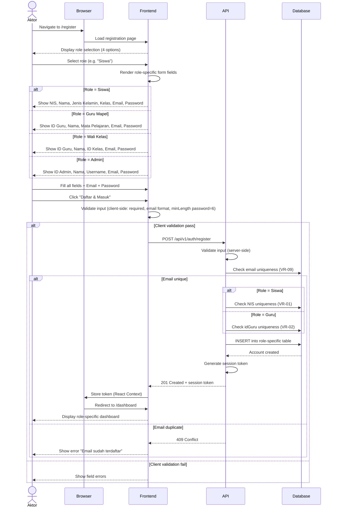

# System Logic: UC-001 Registrasi Akun Mandiri

Document Version: v1.0
Use Case ID: UC-001
Use Case Name: Registrasi Akun Mandiri
Status: Draft
Last Updated: 2026-07-16
Author: System Analyst AI

---

Note: This API contract is provided as a structural reference for future backend implementation. The current prototype uses localStorage / React Context for data persistence and session state (per srs.md Section 9, item 11) — there is no live backend API in this phase.

---

## 1. Overview

This document defines the system logic for self-service account registration. All four roles (Siswa, Guru Mapel, Wali Kelas, Admin) can register through a single endpoint with role-specific fields. The account is immediately active without verification (BR-20). Email must be unique across all roles (VR-09). NIS must be unique for Siswa (VR-01). ID Guru must be unique (VR-02).

---

## 2. Sequence Diagram



---

## 3. API Contract

### 3.1 POST /api/v1/auth/register

Register a new account for any role.

**Request Headers:**

| Header | Value |
| --- | --- |
| Content-Type | application/json |

**Request Body — Siswa:**

```json
{
  "role": "siswa",
  "nis": "string (required, unique per VR-01)",
  "namaLengkap": "string (required)",
  "jenisKelamin": "string (required, 'L' or 'P')",
  "idKelas": "string (required)",
  "email": "string (required, unique per VR-09)",
  "password": "string (required, minLength 6)"
}
```

**Request Example — Siswa:**

```json
{
  "role": "siswa",
  "nis": "2024001",
  "namaLengkap": "Ahmad Rizki",
  "jenisKelamin": "L",
  "idKelas": "VIIA",
  "email": "ahmad@smpn4.sch.id",
  "password": "secret123"
}
```

**Request Body — Guru Mapel:**

```json
{
  "role": "guru_mapel",
  "idGuru": "string (required, unique per VR-02)",
  "namaGuru": "string (required)",
  "mataPelajaran": "string (required for guru_mapel)",
  "email": "string (required, unique per VR-09)",
  "password": "string (required, minLength 6)"
}
```

**Request Body — Wali Kelas:**

```json
{
  "role": "wali_kelas",
  "idGuru": "string (required, unique per VR-02)",
  "namaGuru": "string (required)",
  "idKelas": "string (optional)",
  "email": "string (required, unique per VR-09)",
  "password": "string (required, minLength 6)"
}
```

**Request Body — Admin:**

```json
{
  "role": "admin",
  "idAdmin": "string (required)",
  "namaAdmin": "string (required)",
  "username": "string (required, unique)",
  "email": "string (required, unique per VR-09)",
  "password": "string (required, minLength 6)"
}
```

**Success Response (201 Created):**

```json
{
  "success": true,
  "data": {
    "token": "eyJhbGciOiJIUzI1NiIs...",
    "user": {
      "id": "2024001",
      "role": "siswa",
      "namaLengkap": "Ahmad Rizki",
      "email": "ahmad@smpn4.sch.id"
    },
    "expires_in": 86400
  },
  "message": "Registrasi berhasil"
}
```

**Error Response (409 Conflict — Email Duplicate):**

```json
{
  "success": false,
  "data": null,
  "message": "Email sudah terdaftar",
  "errors": []
}
```

**Error Response (409 Conflict — NIS Duplicate):**

```json
{
  "success": false,
  "data": null,
  "message": "NIS sudah terdaftar",
  "errors": []
}
```

**Error Response (400 Bad Request):**

```json
{
  "success": false,
  "data": null,
  "message": "Validation failed",
  "errors": [
    { "field": "email", "message": "Email harus diisi" },
    { "field": "password", "message": "Password minimal 6 karakter" }
  ]
}
```

---

## 4. Data Flow

| Step | Input | Process | Output |
| --- | --- | --- | --- |
| 1 | Role selection | Frontend renders role-specific form | Role-specific form fields |
| 2 | Form data (role-specific + email + password) | Client-side validation | Validated input |
| 3 | POST /api/v1/auth/register | Server-side validation + uniqueness check | Validation result |
| 4 | Unique email + valid data | INSERT into role table (siswa/guru/admin) | New account record |
| 5 | Account created | Generate session token | Token + user data |
| 6 | Token | React Context storage + redirect | Role-specific dashboard |

---

## 5. Security Rules / Business Rule Enforcement

| Rule | Description |
| --- | --- |
| BR-19 (partial) | Role is set at registration and is immutable (role-locked). Server validates role value. |
| BR-20 | Account is immediately active after registration. No email confirmation or admin approval required. |
| VR-01 | NIS must be unique across all Siswa records. Server checks before INSERT. |
| VR-02 | idGuru must be unique across all Guru records. Server checks before INSERT. |
| VR-09 | Email must be unique across ALL roles (Siswa, Guru, Admin). Server checks global email uniqueness before INSERT. |
| Password | Minimum 6 characters enforced client-side and server-side. Server hashes password with bcrypt (salt rounds >= 12). |

---

## 6. Traceability

| User Flow | Requirement | API Endpoint |
| --- | --- | --- |
| userflow_uc_001.md | F-19, BR-20, VR-01, VR-02, VR-09 | POST /api/v1/auth/register |
