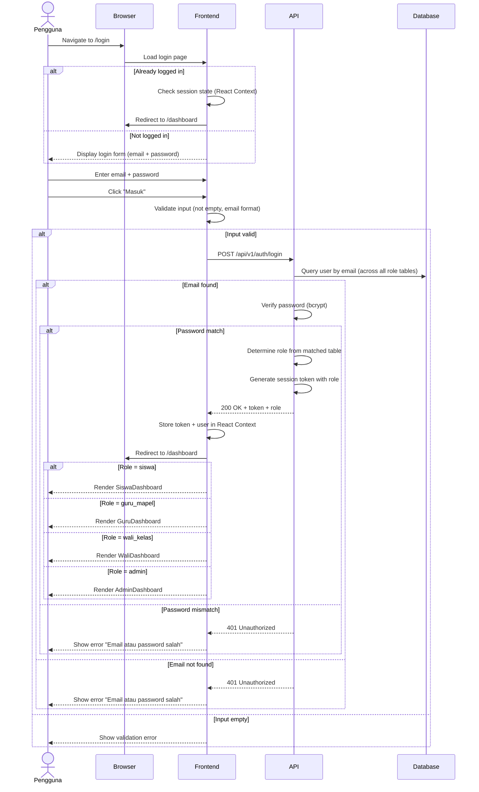

# System Logic: UC-002 Login dengan Role-Locked Redirect

Document Version: v1.0
Use Case ID: UC-002
Use Case Name: Login dengan Role-Locked Redirect
Status: Draft
Last Updated: 2026-07-16
Author: System Analyst AI

---

Note: This API contract is provided as a structural reference for future backend implementation. The current prototype uses localStorage / React Context for data persistence and session state (per srs.md Section 9, item 11) — there is no live backend API in this phase.

---

## 1. Overview

This document defines the system logic for email + password authentication with role-locked redirect. After successful login, the system verifies the account's role and redirects to the appropriate role-specific dashboard (BR-19). An account cannot access dashboards or features of other roles (VR-10). If the user is already logged in and accesses /login, they are redirected to /dashboard.

---

## 2. Sequence Diagram



---

## 3. API Contract

### 3.1 POST /api/v1/auth/login

Authenticate user with email and password. Returns role-specific redirect information.

**Request Headers:**

| Header | Value |
| --- | --- |
| Content-Type | application/json |

**Request Body:**

```json
{
  "email": "string (required)",
  "password": "string (required)"
}
```

**Request Example:**

```json
{
  "email": "ahmad@smpn4.sch.id",
  "password": "secret123"
}
```

**Success Response (200 OK):**

```json
{
  "success": true,
  "data": {
    "token": "eyJhbGciOiJIUzI1NiIs...",
    "user": {
      "id": "2024001",
      "role": "siswa",
      "namaLengkap": "Ahmad Rizki",
      "email": "ahmad@smpn4.sch.id"
    },
    "expires_in": 86400
  },
  "message": "Login successful"
}
```

**Error Response (401 Unauthorized):**

```json
{
  "success": false,
  "data": null,
  "message": "Email atau password salah",
  "errors": []
}
```

**Error Response (400 Bad Request):**

```json
{
  "success": false,
  "data": null,
  "message": "Validation failed",
  "errors": [
    { "field": "email", "message": "Email harus diisi" },
    { "field": "password", "message": "Password harus diisi" }
  ]
}
```

### 3.2 POST /api/v1/auth/logout

Destroy user session.

**Request Headers:**

| Header | Value |
| --- | --- |
| Authorization | Bearer <session_token> |

**Success Response (200 OK):**

```json
{
  "success": true,
  "data": null,
  "message": "Logout successful"
}
```

### 3.3 GET /api/v1/auth/me

Get current authenticated user info (used by frontend to restore session on page reload).

**Request Headers:**

| Header | Value |
| --- | --- |
| Authorization | Bearer <session_token> |

**Success Response (200 OK):**

```json
{
  "success": true,
  "data": {
    "id": "2024001",
    "role": "siswa",
    "namaLengkap": "Ahmad Rizki",
    "email": "ahmad@smpn4.sch.id"
  },
  "message": "Success"
}
```

**Error Response (401 Unauthorized):**

```json
{
  "success": false,
  "data": null,
  "message": "Sesi tidak valid atau sudah berakhir",
  "errors": []
}
```

---

## 4. Data Flow

| Step | Input | Process | Output |
| --- | --- | --- | --- |
| 1 | Email + Password | Frontend validation (not empty) | Validated input |
| 2 | POST /api/v1/auth/login | Server queries all role tables by email | Email match check |
| 3 | Matched email | Verify password with bcrypt | Password match check |
| 4 | Valid credentials | Determine role, generate token | Token + role + user data |
| 5 | Token + role | React Context storage + role-based redirect | Role-specific dashboard |

---

## 5. Security Rules / Business Rule Enforcement

| Rule | Description |
| --- | --- |
| BR-19 | Role-locked login: each account has one fixed role determined at registration. System verifies role on every login and redirects to role-specific dashboard. Account cannot access other roles' dashboards (VR-10). |
| VR-10 | Every authenticated page must validate the user's role. If role does not match allowed roles for that page, redirect to /dashboard. If not logged in, redirect to /login. |
| Password | Error message is generic ("Email atau password salah") for both email-not-found and password-mismatch cases — does not reveal which field is wrong. |
| Session | Token stored in React Context (in-memory). Page reload clears session (prototype behavior per srs.md Section 9). |

---

## 6. Traceability

| User Flow | Requirement | API Endpoint |
| --- | --- | --- |
| userflow_uc_002.md | F-20, BR-19, VR-10 | POST /api/v1/auth/login, POST /api/v1/auth/logout, GET /api/v1/auth/me |
