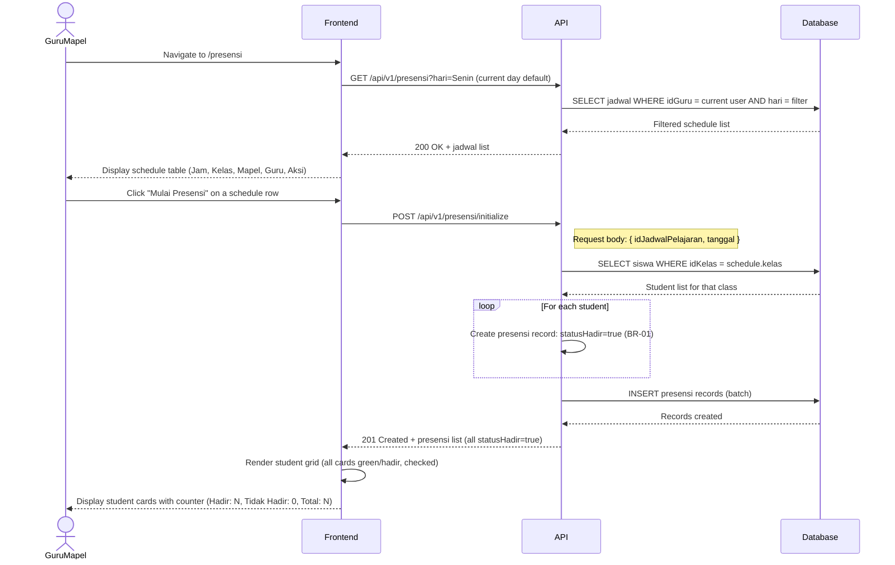
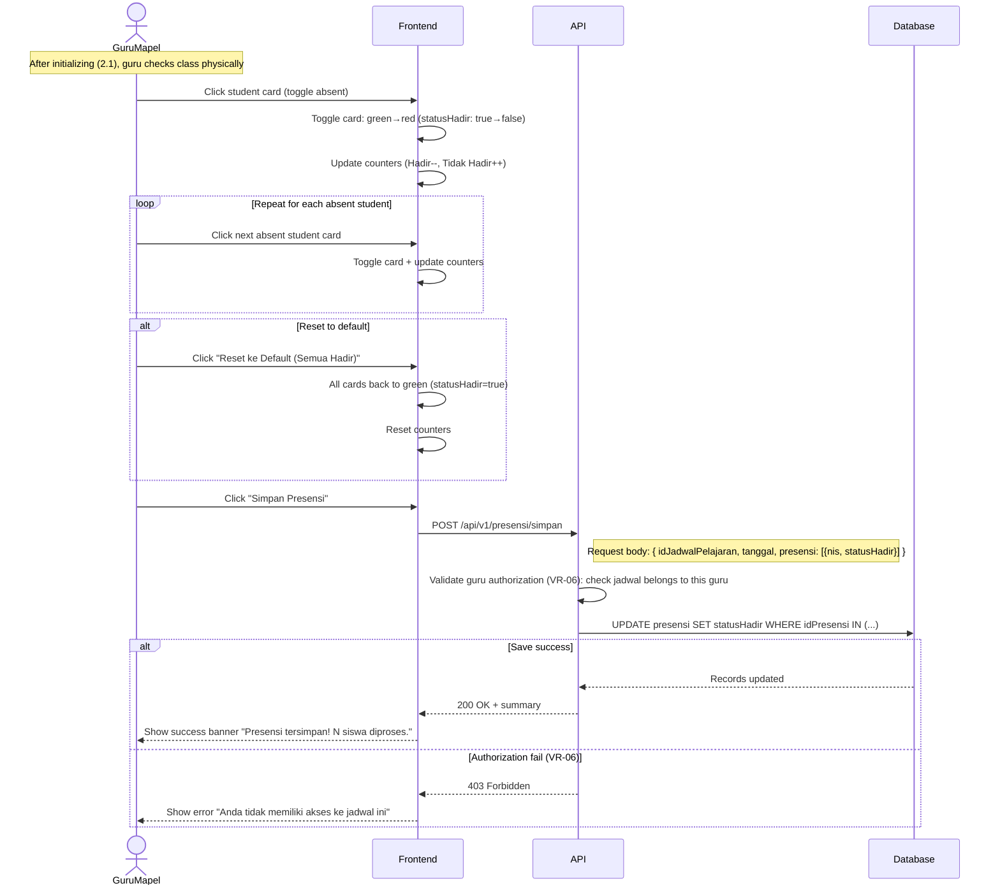
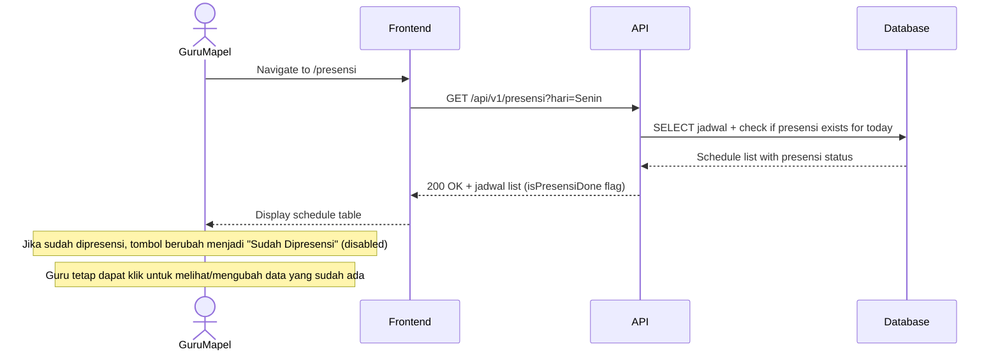

# System Logic: UC-003 Presensi Per Jam Pelajaran (Default-Hadir + Uncheck)

Document Version: v1.0
Use Case ID: UC-003
Use Case Name: Presensi Per Jam Pelajaran (Default-Hadir + Uncheck)
Status: Draft
Last Updated: 2026-07-16
Author: System Analyst AI

---

Note: This API contract is provided as a structural reference for future backend implementation. The current prototype uses localStorage / React Context for data persistence and session state (per srs.md Section 9, item 11) — there is no live backend API in this phase.

---

## 1. Overview

This document defines the system logic for per-lesson attendance. When a Guru Mapel starts a session, the system automatically marks all students as Hadir (default-hadir, BR-01). The guru then unchecks students who are absent (BR-02). This process repeats per lesson period (BR-03). Only the guru assigned to that class and schedule can perform attendance (BR-04, VR-06). The prototype uses localStorage for data persistence.

---

## 2. Sequence Diagram

### 2.1 Load Schedule and Initialize Attendance



### 2.2 Uncheck Absent Students and Save



### 2.3 Schedule Already Taken Attendance



---

## 3. API Contract

### 3.1 POST /api/v1/presensi/initialize

Initialize attendance session with default-hadir for all students in a class.

**Request Headers:**

| Header | Value |
| --- | --- |
| Content-Type | application/json |
| Authorization | Bearer <session_token> |

**Request Body:**

```json
{
  "idJadwalPelajaran": "string (required)",
  "tanggal": "string (required, YYYY-MM-DD)"
}
```

**Request Example:**

```json
{
  "idJadwalPelajaran": "JWP-001",
  "tanggal": "2026-07-16"
}
```

**Success Response (201 Created):**

```json
{
  "success": true,
  "data": {
    "idJadwalPelajaran": "JWP-001",
    "tanggal": "2026-07-16",
    "totalSiswa": 35,
    "presensi": [
      {
        "idPresensi": "PRS-001",
        "nis": "2024001",
        "namaLengkap": "Ahmad Rizki",
        "statusHadir": true
      }
    ]
  },
  "message": "Sesi presensi diinisialisasi dengan default hadir"
}
```

**Error Response (403 Forbidden — VR-06):**

```json
{
  "success": false,
  "data": null,
  "message": "Anda tidak memiliki akses ke jadwal ini",
  "errors": []
}
```

### 3.2 POST /api/v1/presensi/simpan

Save attendance after guru has unchecked absent students.

**Request Headers:**

| Header | Value |
| --- | --- |
| Content-Type | application/json |
| Authorization | Bearer <session_token> |

**Request Body:**

```json
{
  "idJadwalPelajaran": "string (required)",
  "tanggal": "string (required, YYYY-MM-DD)",
  "presensi": [
    { "nis": "string", "statusHadir": true },
    { "nis": "string", "statusHadir": false }
  ]
}
```

**Request Example:**

```json
{
  "idJadwalPelajaran": "JWP-001",
  "tanggal": "2026-07-16",
  "presensi": [
    { "nis": "2024001", "statusHadir": true },
    { "nis": "2024002", "statusHadir": false },
    { "nis": "2024003", "statusHadir": true }
  ]
}
```

**Success Response (200 OK):**

```json
{
  "success": true,
  "data": {
    "totalSiswa": 35,
    "hadir": 33,
    "tidakHadir": 2
  },
  "message": "Presensi tersimpan! 35 siswa diproses."
}
```

**Error Response (400 Bad Request):**

```json
{
  "success": false,
  "data": null,
  "message": "Data presensi tidak lengkap",
  "errors": []
}
```

### 3.3 GET /api/v1/presensi

Query attendance records with filters. Access depends on role (VR-06, VR-07).

**Query Parameters:**

| Parameter | Type | Required | Description |
| --- | --- | --- | --- |
| idJadwalPelajaran | string | No | Filter by schedule ID |
| nis | string | No | Filter by student NIS |
| tanggal | string | No | Filter by date (YYYY-MM-DD) |
| idKelas | string | No | Filter by class (admin/wali kelas only) |

**Success Response (200 OK):**

```json
{
  "success": true,
  "data": {
    "presensi": [
      {
        "idPresensi": "PRS-001",
        "nis": "2024001",
        "namaLengkap": "Ahmad Rizki",
        "idJadwalPelajaran": "JWP-001",
        "mataPelajaran": "Matematika",
        "jamMulai": "07:00",
        "jamSelesai": "08:30",
        "tanggal": "2026-07-16",
        "statusHadir": true,
        "statusManual": "hadir"
      }
    ],
    "total": 35
  },
  "message": "Success"
}
```

---

## 4. Data Flow

| Step | Input | Process | Output |
| --- | --- | --- | --- |
| 1 | Filter hari | Query jadwal by guru + hari | Schedule list |
| 2 | idJadwalPelajaran + tanggal | Query siswa by kelas, INSERT presensi (statusHadir=true) | Default-hadir records |
| 3 | Presensi array (nis + statusHadir) | UPDATE statusHadir per record | Updated attendance |
| 4 | Updated records | Calculate summary (hadir/tidak_hadir/total) | Summary statistics |

---

## 5. Security Rules / Business Rule Enforcement

| Rule | Description |
| --- | --- |
| BR-01 | Default Hadir: All students are automatically marked Hadir (statusHadir=true) when a session starts. System must initialize all records before guru can uncheck. |
| BR-02 | Uncheck oleh Guru: Guru unchecks only students who are truly absent. Students left checked are recorded as Hadir. |
| BR-03 | Per Jam Pelajaran: This process repeats for every lesson period. One student can have different statuses across periods in the same day. |
| BR-04 | Akses Guru Mapel: Guru can only access and perform attendance on classes and schedules they are assigned to. |
| VR-06 | Guru Mapel access restriction: Server validates that the idJadwalPelajaran belongs to the authenticated guru before allowing initialize or save. |
| VR-08 | Default Hadir cannot be empty: System must initialize all students as hadir before guru can perform uncheck. Session cannot start with all students unchecked. |

---

## 6. Traceability

| User Flow | Requirement | API Endpoint |
| --- | --- | --- |
| userflow_uc_003.md | F-01, F-02, F-03, BR-01, BR-02, BR-03, BR-04, VR-06, VR-08 | POST /api/v1/presensi/initialize, POST /api/v1/presensi/simpan, GET /api/v1/presensi |
