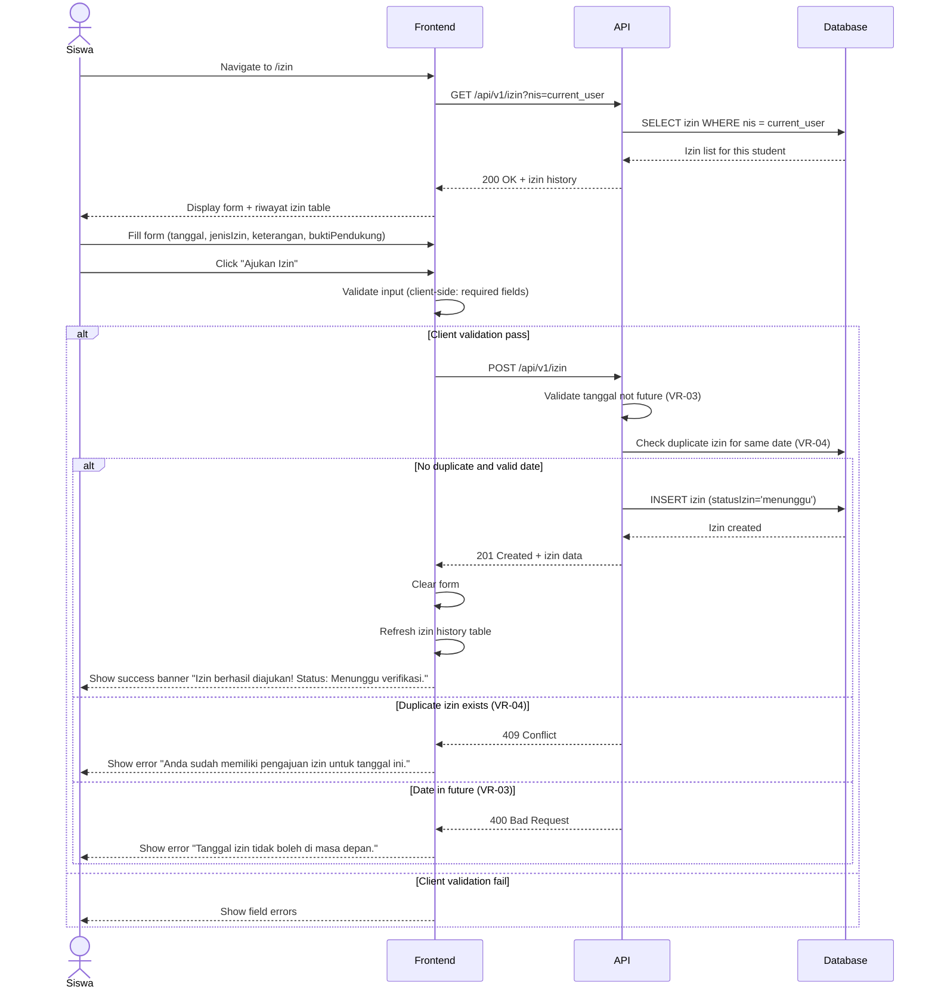

# System Logic: UC-004 Pengajuan Izin Ketidakhadiran

Document Version: v1.0
Use Case ID: UC-004
Use Case Name: Pengajuan Izin Ketidakhadiran
Status: Draft
Last Updated: 2026-07-16
Author: System Analyst AI

---

Note: This API contract is provided as a structural reference for future backend implementation. The current prototype uses localStorage / React Context for data persistence and session state (per srs.md Section 9, item 11) — there is no live backend API in this phase.

---

## 1. Overview

This document defines the system logic for students submitting absence permissions. An izin is per-hari (one submission covers all lesson periods on that date, BR-06). Students select a date, type (sakit/izin/lainnya), description, and upload supporting evidence (BR-07, BR-08). Status starts as "menunggu" (BR-09). Duplicate izin for the same date is rejected (VR-04). Future dates are rejected (VR-03).

---

## 2. Sequence Diagram



---

## 3. API Contract

### 3.1 POST /api/v1/izin

Submit a new absence permission request.

**Request Headers:**

| Header | Value |
| --- | --- |
| Content-Type | application/json |
| Authorization | Bearer <session_token> |

**Request Body:**

```json
{
  "tanggalIzin": "string (required, YYYY-MM-DD)",
  "jenisIzin": "string (required, 'sakit'|'izin'|'lainnya')",
  "keterangan": "string (required)",
  "buktiPendukung": "string (optional, file path or name)"
}
```

**Request Example:**

```json
{
  "tanggalIzin": "2026-07-16",
  "jenisIzin": "sakit",
  "keterangan": "Sakit demam, istirahat di rumah",
  "buktiPendukung": "surat_dokter.pdf"
}
```

**Success Response (201 Created):**

```json
{
  "success": true,
  "data": {
    "idIzin": "IZN-001",
    "nis": "2024001",
    "tanggalIzin": "2026-07-16",
    "jenisIzin": "sakit",
    "keterangan": "Sakit demam, istirahat di rumah",
    "buktiPendukung": "surat_dokter.pdf",
    "statusIzin": "menunggu"
  },
  "message": "Izin berhasil diajukan! Status: Menunggu verifikasi."
}
```

**Error Response (409 Conflict — VR-04 Duplicate):**

```json
{
  "success": false,
  "data": null,
  "message": "Anda sudah memiliki pengajuan izin untuk tanggal ini.",
  "errors": []
}
```

**Error Response (400 Bad Request — VR-03 Future Date):**

```json
{
  "success": false,
  "data": null,
  "message": "Tanggal izin tidak boleh di masa depan.",
  "errors": []
}
```

### 3.2 GET /api/v1/izin

Query absence permissions. Siswa sees only own records. Wali Kelas sees kelas binaan. Admin sees all.

**Query Parameters:**

| Parameter | Type | Required | Description |
| --- | --- | --- | --- |
| nis | string | No | Filter by student NIS (auto-filtered for Siswa role) |
| tanggalIzin | string | No | Filter by date |
| statusIzin | string | No | Filter by status: menunggu/disetujui/ditolak |

**Success Response (200 OK):**

```json
{
  "success": true,
  "data": {
    "izin": [
      {
        "idIzin": "IZN-001",
        "nis": "2024001",
        "namaLengkap": "Ahmad Rizki",
        "tanggalIzin": "2026-07-16",
        "jenisIzin": "sakit",
        "keterangan": "Sakit demam, istirahat di rumah",
        "buktiPendukung": "surat_dokter.pdf",
        "statusIzin": "menunggu"
      }
    ],
    "total": 1
  },
  "message": "Success"
}
```

---

## 4. Data Flow

| Step | Input | Process | Output |
| --- | --- | --- | --- |
| 1 | nis (from session) | Query izin history | Izin list |
| 2 | Form data (tanggal, jenis, keterangan, bukti) | Validate: VR-03 (date not future), VR-04 (no duplicate for same date) | Validation result |
| 3 | Valid data | INSERT izin with statusIzin='menunggu' | New izin record |
| 4 | Created record | Return to frontend, refresh history | Updated izin list |

---

## 5. Security Rules / Business Rule Enforcement

| Rule | Description |
| --- | --- |
| BR-06 | Izin Per Hari: One submission per date. Server checks VR-04 before INSERT. |
| BR-07 | Kategori: Server validates jenisIzin is one of 'sakit', 'izin', 'lainnya'. |
| BR-08 | Bukti Pendukung: Required for submission (enforced as optional in prototype, file name stored as string). |
| BR-09 | Status Izin: Defaults to 'menunggu' on creation. Only wali kelas and admin can change (BR-10). |
| VR-03 | Tanggal Izin Valid: Server rejects future dates. Date must be today or in the past. |
| VR-04 | Satu Izin Per Hari Per Siswa: Server checks for existing izin with status menunggu or disetujui for the same nis + tanggalIzin. Rejects if found. |

---

## 6. Traceability

| User Flow | Requirement | API Endpoint |
| --- | --- | --- |
| userflow_uc_004.md | F-06, F-07, F-08, BR-06, BR-07, BR-08, BR-09, VR-03, VR-04 | POST /api/v1/izin, GET /api/v1/izin |
