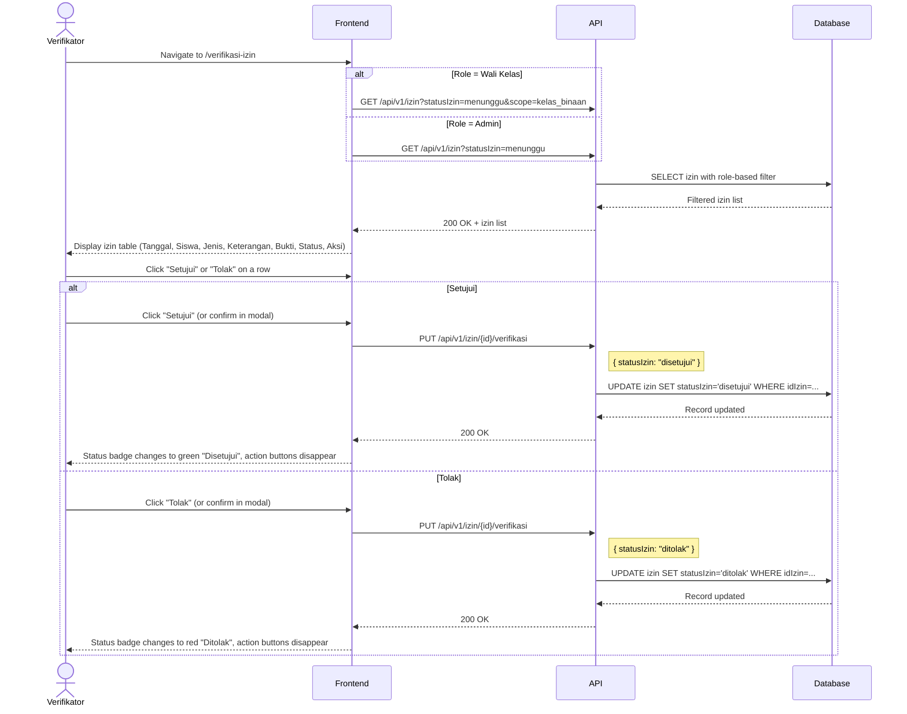

# System Logic: UC-005 Verifikasi Izin oleh Wali Kelas / Admin

Document Version: v1.0
Use Case ID: UC-005
Use Case Name: Verifikasi Izin oleh Wali Kelas / Admin
Status: Draft
Last Updated: 2026-07-16
Author: System Analyst AI

---

Note: This API contract is provided as a structural reference for future backend implementation. The current prototype uses localStorage / React Context for data persistence and session state (per srs.md Section 9, item 11) — there is no live backend API in this phase.

---

## 1. Overview

This document defines the system logic for Wali Kelas and Admin (Guru BK) verifying student absence permissions. Only Wali Kelas and Admin can change izin status (BR-10). Wali Kelas only sees izin from their kelas binaan (VR-07). Admin sees all izin. When approved, izin affects attendance calculation as "hadir" on the daily recap (BR-11).

---

## 2. Sequence Diagram



---

## 3. API Contract

### 3.1 PUT /api/v1/izin/{id}/verifikasi

Approve or reject an absence permission. Only accessible by Wali Kelas and Admin (BR-10).

**Path Parameters:**

| Parameter | Type | Description |
| --- | --- | --- |
| id | string | Izin ID (idIzin) |

**Request Headers:**

| Header | Value |
| --- | --- |
| Content-Type | application/json |
| Authorization | Bearer <session_token> |

**Request Body:**

```json
{
  "statusIzin": "string (required, 'disetujui'|'ditolak')"
}
```

**Request Example:**

```json
{
  "statusIzin": "disetujui"
}
```

**Success Response (200 OK):**

```json
{
  "success": true,
  "data": {
    "idIzin": "IZN-001",
    "nis": "2024001",
    "tanggalIzin": "2026-07-16",
    "jenisIzin": "sakit",
    "statusIzin": "disetujui"
  },
  "message": "Izin berhasil disetujui"
}
```

**Error Response (403 Forbidden):**

```json
{
  "success": false,
  "data": null,
  "message": "Anda tidak memiliki akses untuk memverifikasi izin ini",
  "errors": []
}
```

**Error Response (400 Bad Request — already verified):**

```json
{
  "success": false,
  "data": null,
  "message": "Izin sudah diverifikasi sebelumnya",
  "errors": []
}
```

---

## 4. Data Flow

| Step | Input | Process | Output |
| --- | --- | --- | --- |
| 1 | Role + scope filter | Query izin (Wali Kelas: kelas binaan only; Admin: all) | Filtered izin list |
| 2 | idIzin + statusIzin | Validate: role is wali_kelas or admin (BR-10), izin not yet verified | Validation result |
| 3 | Valid update | UPDATE izin.statusIzin | Updated record |
| 4 | Updated record | Return to frontend, update badge | Visual status change |

---

## 5. Security Rules / Business Rule Enforcement

| Rule | Description |
| --- | --- |
| BR-10 | Verifikator Izin: Only Wali Kelas and Admin can verify izin. Server checks role before allowing PUT. |
| BR-11 | Dampak Izin pada Presensi: When approved, all lesson periods on the izin date count as "Hadir" in daily percentage recap (BR-12, BR-14). This is computed at query time, not stored as a separate record. |
| BR-09 | Status Izin: Server only accepts 'disetujui' or 'ditolak' as valid status values. |
| VR-07 | Wali Kelas access: Wali Kelas only sees izin from students in their kelas binaan. Server filters by kelas relationship. |
| Already Verified | If statusIzin is already 'disetujui' or 'ditolak', server rejects the update with 400. |

---

## 6. Traceability

| User Flow | Requirement | API Endpoint |
| --- | --- | --- |
| userflow_uc_005.md | F-09, BR-10, BR-11 | PUT /api/v1/izin/{id}/verifikasi, GET /api/v1/izin |
