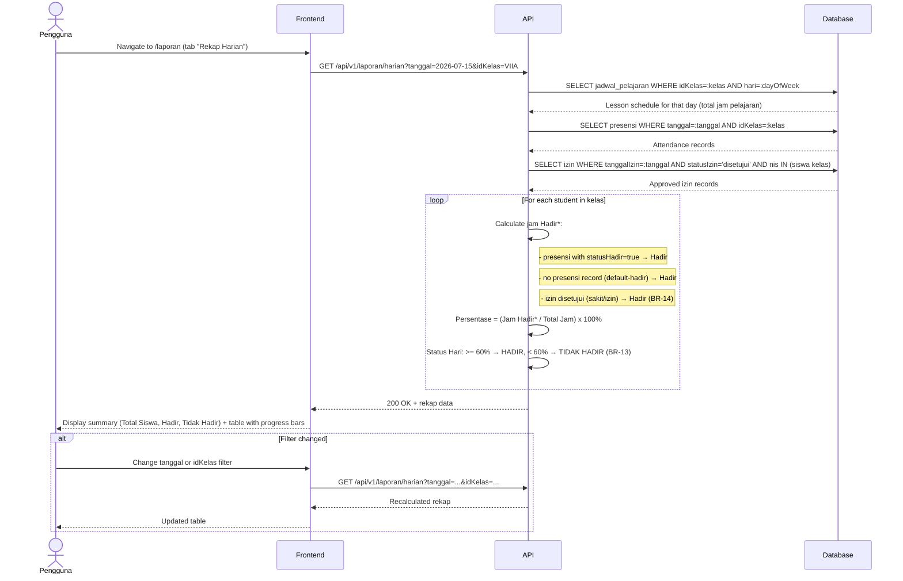

# System Logic: UC-006 Rekap Harian Berbasis Persentase (Otomatis)

Document Version: v1.0
Use Case ID: UC-006
Use Case Name: Rekap Harian Berbasis Persentase (Otomatis)
Status: Draft
Last Updated: 2026-07-16
Author: System Analyst AI

---

Note: This API contract is provided as a structural reference for future backend implementation. The current prototype uses localStorage / React Context for data persistence and session state (per srs.md Section 9, item 11) — there is no live backend API in this phase.

---

## 1. Overview

This document defines the system logic for automatic daily attendance percentage calculation. The system computes each student's daily attendance using the formula from BR-12: Persentase = (Jam Hadir* / Total Jam) x 100%. Threshold is 60% (BR-13): >= 60% = HADIR, < 60% = TIDAK HADIR. Izin/sakit with approved status count as Hadir (BR-14). Calculation is fully automatic (BR-15). Only Admin and Wali Kelas can view this report. Guru Mapel cannot access the daily tab.

---

## 2. Sequence Diagram



---

## 3. API Contract

### 3.1 GET /api/v1/laporan/harian

Get daily attendance percentage report. Only accessible by Wali Kelas (kelas binaan) and Admin (all kelas).

**Query Parameters:**

| Parameter | Type | Required | Description |
| --- | --- | --- | --- |
| tanggal | string | No | Date in YYYY-MM-DD format (default: yesterday/H-1) |
| idKelas | string | No | Filter by specific class |

**Request Headers:**

| Header | Value |
| --- | --- |
| Authorization | Bearer <session_token> |

**Success Response (200 OK):**

```json
{
  "success": true,
  "data": {
    "tanggal": "2026-07-15",
    "totalJamPelajaran": 6,
    "summary": {
      "totalSiswa": 35,
      "hadir": 30,
      "tidakHadir": 5
    },
    "rekap": [
      {
        "nis": "2024001",
        "namaLengkap": "Ahmad Rizki",
        "kelas": "VII A",
        "jamHadir": 5,
        "totalJam": 6,
        "persentase": 83.33,
        "statusHari": "Hadir"
      },
      {
        "nis": "2024002",
        "namaLengkap": "Budi Santoso",
        "kelas": "VII A",
        "jamHadir": 3,
        "totalJam": 6,
        "persentase": 50.00,
        "statusHari": "Tidak Hadir"
      }
    ]
  },
  "message": "Success"
}
```

**Error Response (403 Forbidden):**

```json
{
  "success": false,
  "data": null,
  "message": "Anda tidak memiliki akses ke laporan ini",
  "errors": []
}
```

---

## 4. Data Flow

| Step | Input | Process | Output |
| --- | --- | --- | --- |
| 1 | tanggal + idKelas | Query jadwal for that day → total jam pelajaran | Total jam |
| 2 | tanggal + kelas siswa | Query presensi records | Attendance data |
| 3 | tanggal + nis list + status=disetujui | Query approved izin | Approved izin data |
| 4 | For each student: count jam Hadir* (presensi true + default-hadir + izin approved) | Calculate Persentase = (jam Hadir* / total jam) x 100% | Per-student percentage |
| 5 | Persentase | Apply threshold: >= 60% → HADIR, < 60% → TIDAK HADIR | Status Hari |
| 6 | Rekap data | Aggregate summary + per-student table | Final report |

---

## 5. Security Rules / Business Rule Enforcement

| Rule | Description |
| --- | --- |
| BR-12 | Persentase Harian: Persentase = (Jumlah jam pelajaran dengan status Hadir* / Total jam pelajaran pada hari tersebut) x 100%. Hadir* includes: hadir biasa, sakit (izin disetujui), izin (izin disetujui). |
| BR-13 | Threshold 60%: If Persentase >= 60%, status hari = HADIR. If < 60%, status hari = TIDAK HADIR. |
| BR-14 | Izin/Sakit dihitung sebagai Hadir: Approved izin with jenisIzin='sakit' or 'izin' count as Hadir in the numerator. |
| BR-15 | Otomatisasi: Rekap is computed at query time, not stored. No manual calculation. |
| Role Access | Only Wali Kelas and Admin can view this endpoint. Guru Mapel gets 403. |

---

## 6. Traceability

| User Flow | Requirement | API Endpoint |
| --- | --- | --- |
| userflow_uc_006.md | F-12, BR-12, BR-13, BR-14, BR-15 | GET /api/v1/laporan/harian |
