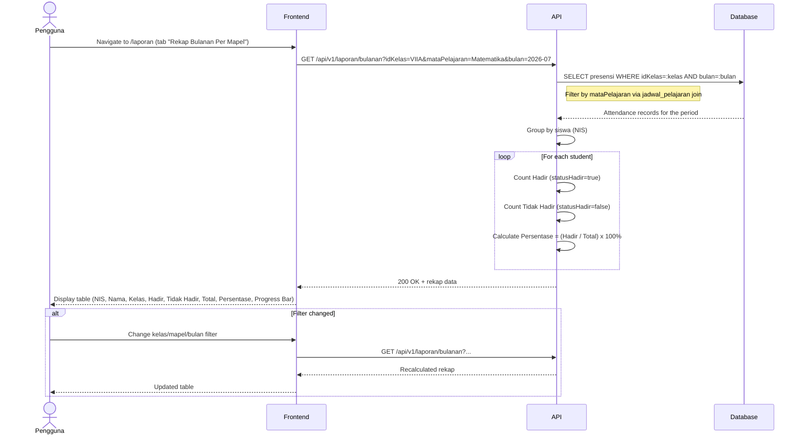

# System Logic: UC-007 Rekap Bulanan Per Mata Pelajaran

Document Version: v1.0
Use Case ID: UC-007
Use Case Name: Rekap Bulanan Per Mata Pelajaran
Status: Draft
Last Updated: 2026-07-16
Author: System Analyst AI

---

Note: This API contract is provided as a structural reference for future backend implementation. The current prototype uses localStorage / React Context for data persistence and session state (per srs.md Section 9, item 11) — there is no live backend API in this phase.

---

## 1. Overview

This document defines the system logic for monthly per-subject attendance recaps. The system displays the number of present and absent sessions for each student in a specific subject over a one-month period (BR-16). This serves as a grading reference for Guru Mapel (BR-17), not an academic grading system. Guru Mapel only sees data for their own subjects (VR-06). Filters include kelas, mataPelajaran, and bulan.

---

## 2. Sequence Diagram



---

## 3. API Contract

### 3.1 GET /api/v1/laporan/bulanan

Get monthly per-subject attendance report.

**Query Parameters:**

| Parameter | Type | Required | Description |
| --- | --- | --- | --- |
| idKelas | string | No | Filter by class |
| mataPelajaran | string | No | Filter by subject name |
| bulan | string | No | Month in YYYY-MM format (e.g. "2026-07") |
| idGuru | string | No | Auto-filtered for Guru Mapel (own subjects only, VR-06) |

**Request Headers:**

| Header | Value |
| --- | --- |
| Authorization | Bearer <session_token> |

**Success Response (200 OK):**

```json
{
  "success": true,
  "data": {
    "filters": {
      "idKelas": "VIIA",
      "mataPelajaran": "Matematika",
      "bulan": "2026-07"
    },
    "rekap": [
      {
        "nis": "2024001",
        "namaLengkap": "Ahmad Rizki",
        "kelas": "VII A",
        "hadir": 18,
        "tidakHadir": 2,
        "total": 20,
        "persentase": 90.00
      }
    ],
    "totalSiswa": 35
  },
  "message": "Success"
}
```

---

## 4. Data Flow

| Step | Input | Process | Output |
| --- | --- | --- | --- |
| 1 | Filters (kelas, mapel, bulan) | Query presensi with filters via jadwal join | Filtered attendance records |
| 2 | Records | Group by NIS, count hadir/tidak_hadir | Per-student counts |
| 3 | Counts | Calculate Persentase = (Hadir / Total) x 100% | Per-student percentage |
| 4 | Rekap data | Return to frontend with summary | Monthly report table |

---

## 5. Security Rules / Business Rule Enforcement

| Rule | Description |
| --- | --- |
| BR-16 | Periode Bulanan: Rekap is calculated per one-month period, per subject. Server filters by bulan parameter. |
| BR-17 | Acuan Penilaian: This report is a grading reference, not an academic grading system. Data is read-only. |
| BR-18 | Isi Rekap: Displays jumlah hadir and jumlah tidak_hadir for each student per subject per month. |
| VR-06 | Guru Mapel access: Guru Mapel only sees data for subjects they teach. Server auto-filters by the authenticated guru's mataPelajaran. |

---

## 6. Traceability

| User Flow | Requirement | API Endpoint |
| --- | --- | --- |
| userflow_uc_007.md | F-11, F-13, BR-16, BR-17, BR-18 | GET /api/v1/laporan/bulanan |
