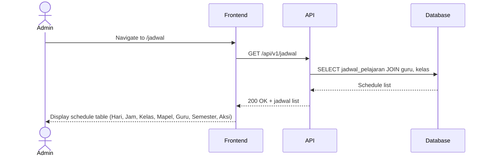
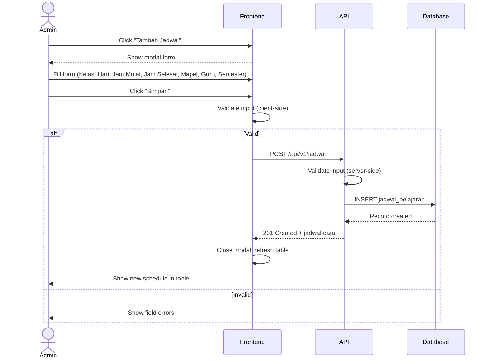
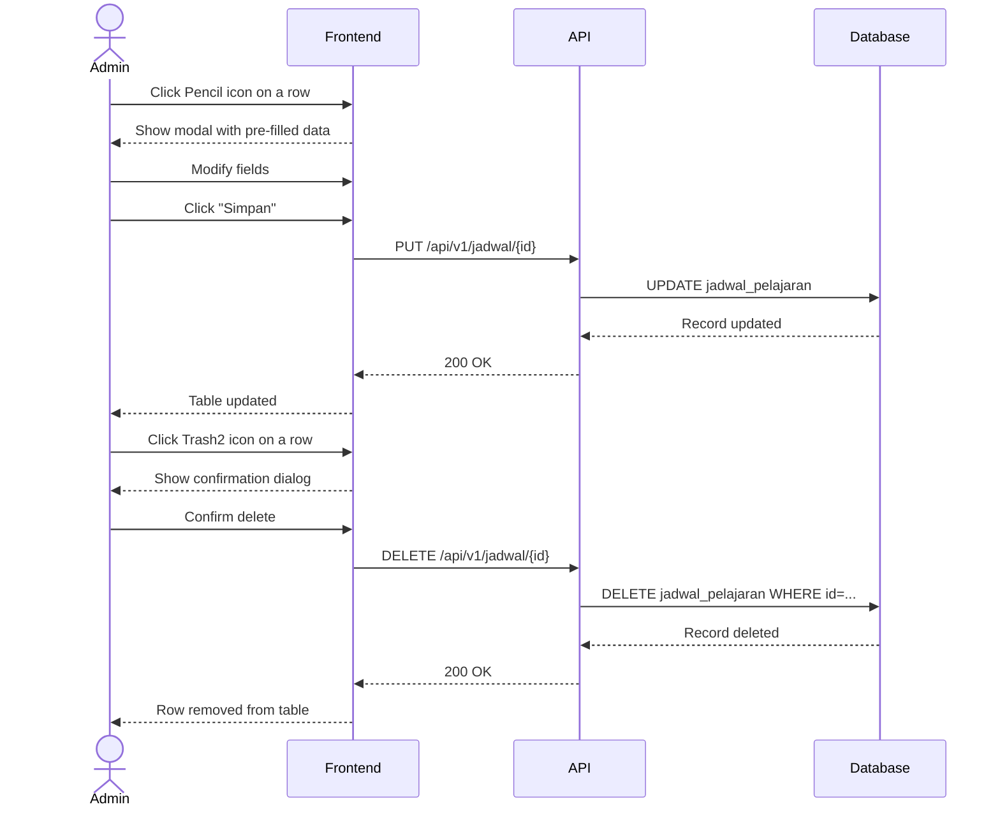

# System Logic: UC-008 Pengaturan Jadwal Pelajaran

Document Version: v1.0
Use Case ID: UC-008
Use Case Name: Pengaturan Jadwal Pelajaran
Status: Draft
Last Updated: 2026-07-16
Author: System Analyst AI

---

Note: This API contract is provided as a structural reference for future backend implementation. The current prototype uses localStorage / React Context for data persistence and session state (per srs.md Section 9, item 11) — there is no live backend API in this phase.

---

## 1. Overview

This document defines the system logic for Admin (Guru BK) managing lesson schedules. Admin can create, read, update, and delete schedule entries (F-15, F-16). Each schedule entry defines one lesson period for a specific class on a specific day, including the subject, time range, and assigned guru. Only Admin can access this feature (VR-10).

---

## 2. Sequence Diagram

### 2.1 Load Schedule List



### 2.2 Create Schedule



### 2.3 Update and Delete Schedule



---

## 3. API Contract

### 3.1 GET /api/v1/jadwal

Query lesson schedules with filters.

**Query Parameters:**

| Parameter | Type | Required | Description |
| --- | --- | --- | --- |
| idKelas | string | No | Filter by class |
| hari | string | No | Filter by day (Senin-Sabtu) |
| idGuru | string | No | Filter by guru (auto-set for Guru Mapel, VR-06) |

**Request Headers:**

| Header | Value |
| --- | --- |
| Authorization | Bearer <session_token> |

**Success Response (200 OK):**

```json
{
  "success": true,
  "data": {
    "jadwal": [
      {
        "idJadwalPelajaran": "JWP-001",
        "idKelas": "VIIA",
        "namaKelas": "VII A",
        "idGuru": "GRU-001",
        "namaGuru": "Pak Budi",
        "hari": "Senin",
        "jamMulai": "07:00",
        "jamSelesai": "08:30",
        "mataPelajaran": "Matematika",
        "semester": "2025/2026-Ganjil"
      }
    ],
    "total": 45
  },
  "message": "Success"
}
```

### 3.2 POST /api/v1/jadwal

Create a new lesson schedule entry. Admin only.

**Request Headers:**

| Header | Value |
| --- | --- |
| Content-Type | application/json |
| Authorization | Bearer <session_token> |

**Request Body:**

```json
{
  "idKelas": "string (required)",
  "idGuru": "string (required)",
  "hari": "string (required, 'Senin'|'Selasa'|'Rabu'|'Kamis'|'Jumat'|'Sabtu')",
  "jamMulai": "string (required, HH:MM)",
  "jamSelesai": "string (required, HH:MM)",
  "mataPelajaran": "string (required)",
  "semester": "string (required)"
}
```

**Request Example:**

```json
{
  "idKelas": "VIIA",
  "idGuru": "GRU-001",
  "hari": "Senin",
  "jamMulai": "07:00",
  "jamSelesai": "08:30",
  "mataPelajaran": "Matematika",
  "semester": "2025/2026-Ganjil"
}
```

**Success Response (201 Created):**

```json
{
  "success": true,
  "data": {
    "idJadwalPelajaran": "JWP-001",
    "idKelas": "VIIA",
    "namaKelas": "VII A",
    "idGuru": "GRU-001",
    "namaGuru": "Pak Budi",
    "hari": "Senin",
    "jamMulai": "07:00",
    "jamSelesai": "08:30",
    "mataPelajaran": "Matematika",
    "semester": "2025/2026-Ganjil"
  },
  "message": "Jadwal berhasil ditambahkan"
}
```

**Error Response (403 Forbidden):**

```json
{
  "success": false,
  "data": null,
  "message": "Hanya admin yang dapat mengelola jadwal",
  "errors": []
}
```

### 3.3 PUT /api/v1/jadwal/{id}

Update an existing schedule entry. Admin only.

**Request Body:** Same as POST, all fields optional.

**Success Response (200 OK):**

```json
{
  "success": true,
  "data": { ... },
  "message": "Jadwal berhasil diperbarui"
}
```

### 3.4 DELETE /api/v1/jadwal/{id}

Delete a schedule entry. Admin only.

**Success Response (200 OK):**

```json
{
  "success": true,
  "data": null,
  "message": "Jadwal berhasil dihapus"
}
```

---

## 4. Data Flow

| Step | Input | Process | Output |
| --- | --- | --- | --- |
| 1 | Filter params | Query jadwal with filters | Filtered schedule list |
| 2 | Form data | Validate + INSERT jadwal_pelajaran | New schedule record |
| 3 | id + form data | Validate + UPDATE jadwal_pelajaran | Updated record |
| 4 | id | Validate + DELETE jadwal_pelajaran | Record removed |

---

## 5. Security Rules / Business Rule Enforcement

| Rule | Description |
| --- | --- |
| F-15 | Admin mengatur jadwal: Only Admin can create, update, and delete schedule entries. Server checks role = admin before POST/PUT/DELETE. |
| F-16 | Admin mengubah jadwal: Admin can modify existing schedules. |
| VR-10 | Role-locked access: Non-admin users accessing /jadwal endpoints receive 403 Forbidden. |
| Validation | Server validates: hari must be in (Senin-Sabtu), jamMulai < jamSelesai, required fields present. |

---

## 6. Traceability

| User Flow | Requirement | API Endpoint |
| --- | --- | --- |
| userflow_uc_008.md | F-15, F-16 | GET /api/v1/jadwal, POST /api/v1/jadwal, PUT /api/v1/jadwal/{id}, DELETE /api/v1/jadwal/{id} |
