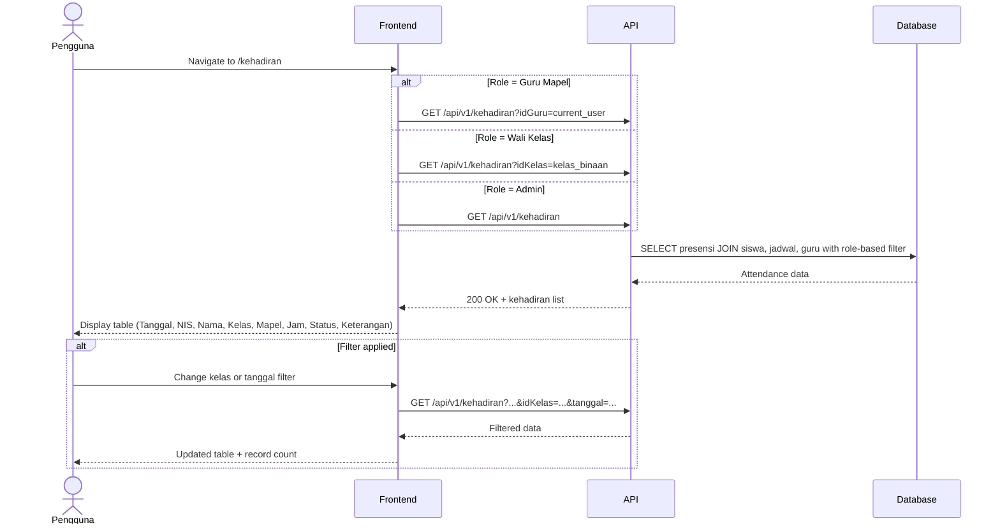

# System Logic: UC-009 Lihat Data Kehadiran Real-time

Document Version: v1.0
Use Case ID: UC-009
Use Case Name: Lihat Data Kehadiran Real-time
Status: Draft
Last Updated: 2026-07-16
Author: System Analyst AI

---

Note: This API contract is provided as a structural reference for future backend implementation. The current prototype uses localStorage / React Context for data persistence and session state (per srs.md Section 9, item 11) — there is no live backend API in this phase.

---

## 1. Overview

This document defines the system logic for Guru Mapel and Wali Kelas viewing real-time attendance data. Guru Mapel only sees data for classes and schedules they teach (VR-06). Wali Kelas sees all students in their kelas binaan (VR-07). Data can be filtered by kelas and tanggal. The endpoint is shared across UC-009, UC-012 (Admin verify), with role-based filtering applied server-side.

---

## 2. Sequence Diagram



---

## 3. API Contract

### 3.1 GET /api/v1/kehadiran

Query attendance data for viewing/verification. Role-based filtering applies.

**Query Parameters:**

| Parameter | Type | Required | Description |
| --- | --- | --- | --- |
| idKelas | string | No | Filter by class |
| tanggal | string | No | Filter by date (YYYY-MM-DD) |
| nis | string | No | Filter by student NIS |

**Request Headers:**

| Header | Value |
| --- | --- |
| Authorization | Bearer <session_token> |

**Success Response (200 OK):**

```json
{
  "success": true,
  "data": {
    "kehadiran": [
      {
        "idPresensi": "PRS-001",
        "tanggal": "2026-07-16",
        "nis": "2024001",
        "namaLengkap": "Ahmad Rizki",
        "kelas": "VII A",
        "mataPelajaran": "Matematika",
        "jamMulai": "07:00",
        "jamSelesai": "08:30",
        "statusHadir": true,
        "statusManual": "hadir"
      }
    ],
    "total": 35
  },
  "message": "Success"
}
```

---

## 4. Data Flow

| Step | Input | Process | Output |
| --- | --- | --- | --- |
| 1 | Role + filters | Apply role-based filter (VR-06/VR-07) | Authorized query scope |
| 2 | Query params | JOIN presensi + siswa + jadwal + guru | Enriched attendance data |
| 3 | Data | Return to frontend with total count | Attendance table |

---

## 5. Security Rules / Business Rule Enforcement

| Rule | Description |
| --- | --- |
| F-05 | Melihat data kehadiran real-time: Guru Mapel sees own classes only; Wali Kelas sees kelas binaan; Admin sees all. |
| VR-06 | Guru Mapel access: Server filters presensi records by idGuru matching the authenticated guru. Only records from schedules assigned to this guru are returned. |
| VR-07 | Wali Kelas access: Server filters presensi records by idKelas matching the wali kelas's binaan class. All students in that class are visible. |
| Admin | Admin has no role-based filter; sees all presensi records across all classes and schedules. |

---

## 6. Traceability

| User Flow | Requirement | API Endpoint |
| --- | --- | --- |
| userflow_uc_009.md | F-05, VR-06, VR-07 | GET /api/v1/kehadiran |
