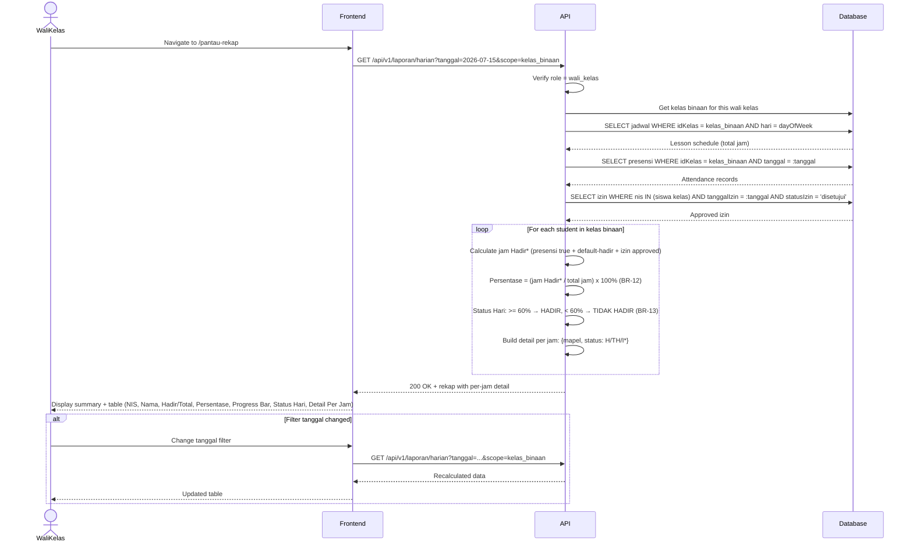

# System Logic: UC-010 Pantau Rekap Kelas oleh Wali Kelas

Document Version: v1.0
Use Case ID: UC-010
Use Case Name: Pantau Rekap Kelas oleh Wali Kelas
Status: Draft
Last Updated: 2026-07-16
Author: System Analyst AI

---

Note: This API contract is provided as a structural reference for future backend implementation. The current prototype uses localStorage / React Context for data persistence and session state (per srs.md Section 9, item 11) — there is no live backend API in this phase.

---

## 1. Overview

This document defines the system logic for Wali Kelas monitoring class attendance in real-time. This page shows daily percentage-based recaps for the kelas binaan, including per-lesson-period detail (BR-12 to BR-15). Only Wali Kelas can access this endpoint (VR-10). The recalculation uses the same formula as UC-006 but scoped to the wali kelas's own class.

---

## 2. Sequence Diagram



---

## 3. API Contract

### 3.1 GET /api/v1/laporan/harian (with scope=kelas_binaan)

This reuses the same endpoint as UC-006 but is called by Wali Kelas with a scope parameter. The server detects the role and applies kelas binaan filter automatically.

**Query Parameters:**

| Parameter | Type | Required | Description |
| --- | --- | --- | --- |
| tanggal | string | No | Date in YYYY-MM-DD (default: yesterday) |
| scope | string | No | "kelas_binaan" (auto-applied for Wali Kelas role) |

**Request Headers:**

| Header | Value |
| --- | --- |
| Authorization | Bearer <session_token> |

**Success Response (200 OK):**

```json
{
  "success": true,
  "data": {
    "tanggal": "2026-07-15",
    "kelas": "VII A",
    "waliKelas": "Ibu Sari",
    "totalJamPelajaran": 6,
    "summary": {
      "totalSiswa": 35,
      "hadir": 30,
      "tidakHadir": 5
    },
    "rekap": [
      {
        "nis": "2024001",
        "namaLengkap": "Ahmad Rizki",
        "jamHadir": 5,
        "totalJam": 6,
        "persentase": 83.33,
        "statusHari": "Hadir",
        "detailPerJam": [
          { "jam": "07:00-08:30", "mapel": "Mat", "status": "H" },
          { "jam": "08:30-10:00", "mapel": "B.Ing", "status": "H" },
          { "jam": "10:15-11:45", "mapel": "B.Ina", "status": "TH" },
          { "jam": "12:30-14:00", "mapel": "IPA", "status": "H" },
          { "jam": "14:00-15:30", "mapel": "IPS", "status": "H" },
          { "jam": "15:30-17:00", "mapel": "PJOK", "status": "H" }
        ]
      }
    ]
  },
  "message": "Success"
}
```

**Error Response (403 Forbidden):**

```json
{
  "success": false,
  "data": null,
  "message": "Hanya wali kelas yang dapat mengakses halaman ini",
  "errors": []
}
```

---

## 4. Data Flow

| Step | Input | Process | Output |
| --- | --- | --- | --- |
| 1 | tanggal | Get kelas binaan for authenticated wali kelas | Class ID |
| 2 | idKelas + dayOfWeek | Query jadwal → total jam pelajaran | Total jam |
| 3 | idKelas + tanggal | Query presensi | Attendance records |
| 4 | nis list + tanggal + status=disetujui | Query approved izin | Approved izin |
| 5 | For each student: calculate jam Hadir*, Persentase, Status Hari, detailPerJam | BR-12/13/14 formula | Per-student rekap |
| 6 | Rekap + detail | Return to frontend | Full report with per-jam breakdown |

---

## 5. Security Rules / Business Rule Enforcement

| Rule | Description |
| --- | --- |
| BR-12 | Persentase Harian formula applied: (Jam Hadir* / Total Jam) x 100%. |
| BR-13 | Threshold 60%: >= 60% = HADIR, < 60% = TIDAK HADIR. |
| BR-14 | Izin/Sakit approved count as Hadir in numerator. |
| BR-15 | Otomatisasi: Computed at query time, no manual calculation. |
| VR-07 | Wali Kelas only: Server verifies role = wali_kelas and restricts to kelas binaan. Other roles get 403. |
| Detail Per Jam | Each jam entry shows: mapel abbreviation, status (H=Hadir, TH=Tidak Hadir, I*=Izin approved). |

---

## 6. Traceability

| User Flow | Requirement | API Endpoint |
| --- | --- | --- |
| userflow_uc_010.md | F-12, F-05, BR-12, BR-13, BR-14, BR-15 | GET /api/v1/laporan/harian (scope=kelas_binaan) |
