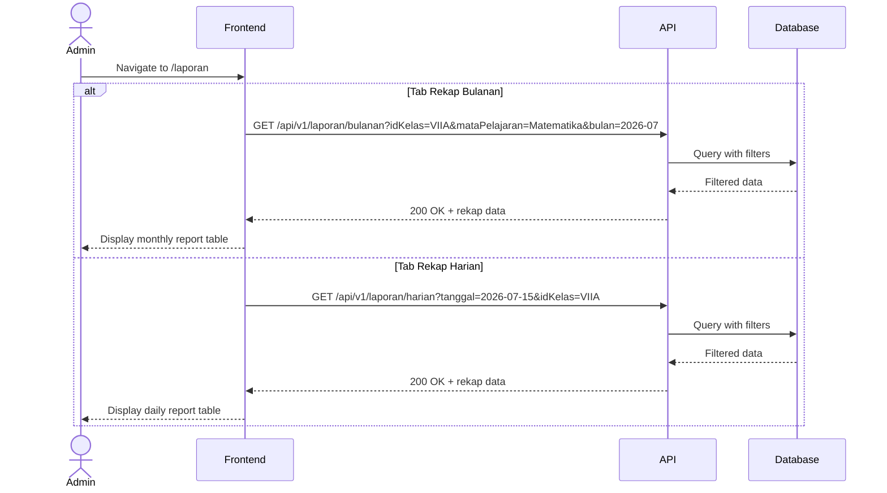
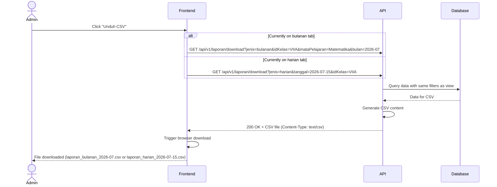

# System Logic: UC-011 Filter dan Unduh Laporan Rekapitulasi

Document Version: v1.0
Use Case ID: UC-011
Use Case Name: Filter dan Unduh Laporan Rekapitulasi
Status: Draft
Last Updated: 2026-07-16
Author: System Analyst AI

---

Note: This API contract is provided as a structural reference for future backend implementation. The current prototype uses localStorage / React Context for data persistence and session state (per srs.md Section 9, item 11) — there is no live backend API in this phase.

---

## 1. Overview

This document defines the system logic for Admin filtering and downloading attendance reports as CSV. Admin can filter by kelas, tanggal (for harian), mataPelajaran, and bulan (for bulanan). The download endpoint returns a CSV file based on the currently filtered data (F-13, F-14). This reuses the same data endpoints as UC-006/UC-007 but adds the CSV export endpoint.

---

## 2. Sequence Diagram

### 2.1 Filter and View Report



### 2.2 Download CSV



---

## 3. API Contract

### 3.1 GET /api/v1/laporan/download

Download attendance report as CSV.

**Query Parameters:**

| Parameter | Type | Required | Description |
| --- | --- | --- | --- |
| jenis | string | Yes | "harian" or "bulanan" |
| idKelas | string | No | Filter by class |
| mataPelajaran | string | No | Filter by subject (bulanan only) |
| bulan | string | No | Month in YYYY-MM format (bulanan only) |
| tanggal | string | No | Date in YYYY-MM-DD (harian only) |

**Request Headers:**

| Header | Value |
| --- | --- |
| Authorization | Bearer <session_token> |

**Success Response (200 OK):**

Content-Type: text/csv

```
NIS,Nama,Kelas,Hadir,Tidak Hadir,Total,Persentase
2024001,Ahmad Rizki,VII A,18,2,20,90.00%
2024002,Budi Santoso,VII A,15,5,20,75.00%
```

For harian report:

```
NIS,Nama,Kelas,Hadir/Total,Persentase,Status Hari
2024001,Ahmad Rizki,VII A,5/6,83.33%,Hadir
2024002,Budi Santoso,VII A,3/6,50.00%,Tidak Hadir
```

**Error Response (403 Forbidden):**

```json
{
  "success": false,
  "data": null,
  "message": "Hanya admin yang dapat mengunduh laporan",
  "errors": []
}
```

---

## 4. Data Flow

| Step | Input | Process | Output |
| --- | --- | --- | --- |
| 1 | Filter params | Query data using same logic as UC-006/UC-007 | Raw attendance data |
| 2 | Raw data | Generate CSV string (header + rows) | CSV content |
| 3 | CSV content | Return with Content-Type: text/csv + Content-Disposition header | Downloadable file |

---

## 5. Security Rules / Business Rule Enforcement

| Rule | Description |
| --- | --- |
| F-13 | Filter laporan: Admin can filter by kelas, tanggal, nama siswa, mataPelajaran, bulan. |
| F-14 | Unduh laporan: Only Admin can download reports as CSV. Server checks role = admin. |
| BR-16 | Bulanan filter uses periodeAwal/periodeAkhir derived from bulan parameter. |
| Role | Only Admin role can access this download endpoint. Wali Kelas and Guru Mapel receive 403. |

---

## 6. Traceability

| User Flow | Requirement | API Endpoint |
| --- | --- | --- |
| userflow_uc_011.md | F-13, F-14 | GET /api/v1/laporan/download, GET /api/v1/laporan/bulanan, GET /api/v1/laporan/harian |
