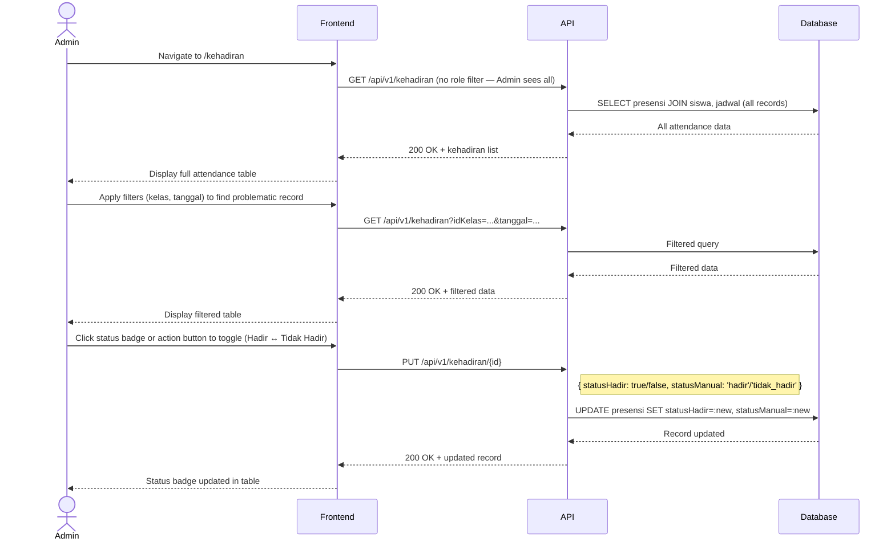

# System Logic: UC-012 Verifikasi Data Presensi Bermasalah oleh Admin

Document Version: v1.0
Use Case ID: UC-012
Use Case Name: Verifikasi Data Presensi Bermasalah oleh Admin
Status: Draft
Last Updated: 2026-07-16
Author: System Analyst AI

---

Note: This API contract is provided as a structural reference for future backend implementation. The current prototype uses localStorage / React Context for data persistence and session state (per srs.md Section 9, item 11) — there is no live backend API in this phase.

---

## 1. Overview

This document defines the system logic for Admin (Guru BK) verifying and correcting problematic attendance data (F-04, BR-05). Admin can view all attendance records (without role-based filtering) and toggle individual student statuses between Hadir and Tidak Hadir. This reuses the same GET /api/v1/kehadiran endpoint as UC-009 but with Admin-level access (no filter).

---

## 2. Sequence Diagram



---

## 3. API Contract

### 3.1 PUT /api/v1/kehadiran/{id}

Correct an attendance record. Admin only.

**Path Parameters:**

| Parameter | Type | Description |
| --- | --- | --- |
| id | string | Presensi ID (idPresensi) |

**Request Headers:**

| Header | Value |
| --- | --- |
| Content-Type | application/json |
| Authorization | Bearer <session_token> |

**Request Body:**

```json
{
  "statusHadir": "boolean (required)",
  "statusManual": "string (required, 'hadir'|'tidak_hadir')"
}
```

**Request Example:**

```json
{
  "statusHadir": true,
  "statusManual": "hadir"
}
```

**Success Response (200 OK):**

```json
{
  "success": true,
  "data": {
    "idPresensi": "PRS-001",
    "nis": "2024001",
    "tanggal": "2026-07-16",
    "statusHadir": true,
    "statusManual": "hadir"
  },
  "message": "Data presensi berhasil diperbarui"
}
```

**Error Response (403 Forbidden):**

```json
{
  "success": false,
  "data": null,
  "message": "Hanya admin yang dapat memverifikasi data presensi",
  "errors": []
}
```

---

## 4. Data Flow

| Step | Input | Process | Output |
| --- | --- | --- | --- |
| 1 | (no filter) | Query all presensi records (Admin sees all) | Full attendance data |
| 2 | Filter params | Apply kelas/tanggal filter | Filtered records |
| 3 | idPresensi + new status | Validate role = admin, UPDATE presensi | Updated record |
| 4 | Updated record | Return to frontend, update badge | Visual status change |

---

## 5. Security Rules / Business Rule Enforcement

| Rule | Description |
| --- | --- |
| F-04 | Verifikasi data presensi bermasalah: Admin can verify and correct attendance records. |
| BR-05 | Verifikasi Admin: Admin (Guru BK) can verify and fix problematic presensi data when recording errors occur. |
| VR-10 | Role-locked: Only Admin can access PUT /api/v1/kehadiran/{id}. Guru Mapel and Wali Kelas receive 403. |
| Status Toggle | Admin can toggle between Hadir (statusHadir=true, statusManual='hadir') and Tidak Hadir (statusHadir=false, statusManual='tidak_hadir'). |

---

## 6. Traceability

| User Flow | Requirement | API Endpoint |
| --- | --- | --- |
| userflow_uc_012.md | F-04, BR-05 | GET /api/v1/kehadiran, PUT /api/v1/kehadiran/{id} |
