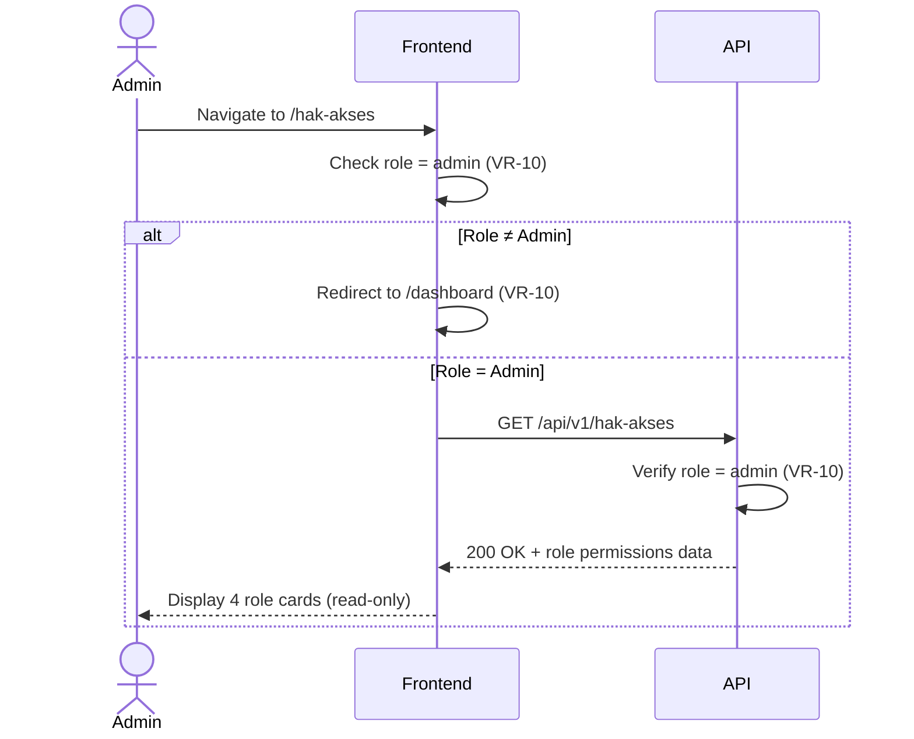

# System Logic: UC-013 Kelola Hak Akses Pengguna (Read-Only)

Document Version: v1.0
Use Case ID: UC-013
Use Case Name: Kelola Hak Akses Pengguna (Read-Only)
Status: Draft
Last Updated: 2026-07-17
Author: System Analyst AI

---

Note: This API contract is provided as a structural reference for future backend implementation. The current prototype uses localStorage / React Context for data persistence and session state (per srs.md Section 9, item 11) — there is no live backend API in this phase.

---

## 1. Overview

This document defines the system logic for Admin (Guru BK) viewing role-based access permissions (F-17, srs.md Section 4.5). The page at `/hak-akses` displays four read-only cards — one for each role (Siswa, Guru Mapel, Wali Kelas, Admin) — showing the permissions and restrictions of each role. This is an informational page with no CRUD operations. Only Admin can access this page (VR-10).

---

## 2. Sequence Diagram



---

## 3. API Contract

### 3.1 GET /api/v1/hak-akses

Retrieve role-based access permissions. Admin only.

**Request Headers:**

| Header | Value |
| --- | --- |
| Content-Type | application/json |
| Authorization | Bearer \<session_token\> |

**Success Response (200 OK):**

```json
{
  "success": true,
  "data": [
    {
      "role": "siswa",
      "permissions": [
        "Melihat data kehadiran sendiri",
        "Mengajukan izin ketidakhadiran",
        "Melihat riwayat kehadiran sendiri"
      ],
      "restrictions": [
        "Hanya dapat mengakses data milik sendiri",
        "Tidak dapat mengakses data siswa lain",
        "Tidak dapat melihat rekap kelas",
        "Tidak dapat mengelola jadwal"
      ]
    },
    {
      "role": "guru_mapel",
      "permissions": [
        "Melihat data kehadiran kelas yang diampu",
        "Memverifikasi kehadiran siswa (uncheck)",
        "Melihat rekap bulanan mata pelajaran yang diampu"
      ],
      "restrictions": [
        "Hanya dapat mengakses kelas yang diampu",
        "Tidak dapat mengakses data kelas lain",
        "Tidak dapat mengelola jadwal",
        "Tidak dapat memverifikasi izin"
      ]
    },
    {
      "role": "wali_kelas",
      "permissions": [
        "Semua hak akses guru mapel",
        "Memverifikasi izin siswa binaan",
        "Melihat rekap harian kelas binaan",
        "Melihat rekap bulanan kelas binaan"
      ],
      "restrictions": [
        "Hanya dapat mengakses kelas binaan",
        "Tidak dapat mengelola jadwal",
        "Tidak dapat memverifikasi data presensi bermasalah"
      ]
    },
    {
      "role": "admin",
      "permissions": [
        "Akses seluruh fitur sistem",
        "Mengelola jadwal pelajaran",
        "Memverifikasi data presensi bermasalah",
        "Melihat seluruh rekap kehadiran",
        "Mengunduh laporan rekapitulasi"
      ],
      "restrictions": []
    }
  ],
  "message": "Berhasil mengambil data hak akses"
}
```

**Error Response (401 Unauthorized):**

```json
{
  "success": false,
  "data": null,
  "message": "Token tidak valid atau telah kedaluwarsa",
  "errors": []
}
```

**Error Response (403 Forbidden):**

```json
{
  "success": false,
  "data": null,
  "message": "Hanya admin yang dapat mengakses data hak akses",
  "errors": []
}
```

---

## 4. Data Flow

| Step | Input | Process | Output |
| --- | --- | --- | --- |
| 1 | Admin navigates to `/hak-akses` | Frontend checks role = admin (VR-10) | Role validation |
| 2 | GET /api/v1/hak-akses | Server verifies role = admin | Role permissions data |
| 3 | Role permissions data | Frontend renders 4 role cards | Read-only UI (no CRUD) |
| 4 | Admin reads permissions and restrictions | No further action | Information consumed |

---

## 5. Security Rules / Business Rule Enforcement

| Rule | Description |
| --- | --- |
| F-17 | Mengelola hak akses pengguna (srs.md Section 4.5): Admin mengatur hak akses pengguna berdasarkan peran — siswa hanya dapat mengakses data sendiri, guru mapel hanya dapat mengakses kelas yang diampu, wali kelas memiliki akses tambahan ke kelas binaan, admin dapat mengakses seluruh fitur. |
| VR-10 | Akses Terkunci Peran: Hanya Admin yang dapat mengakses `/hak-akses`. Siswa, Guru Mapel, dan Wali Kelas di-redirect ke `/dashboard`. Server dan frontend memvalidasi peran. |
| Read-Only | Halaman bersifat informatif. Tidak ada operasi CREATE, UPDATE, atau DELETE hak akses melalui UI ini. Perubahan hak akses dilakukan di luar lingkup F-17. |

---

## 6. Traceability

| User Flow | Requirement | API Endpoint |
| --- | --- | --- |
| userflow_uc_013.md | F-17 (srs.md Section 4.5), VR-10 | GET /api/v1/hak-akses |
