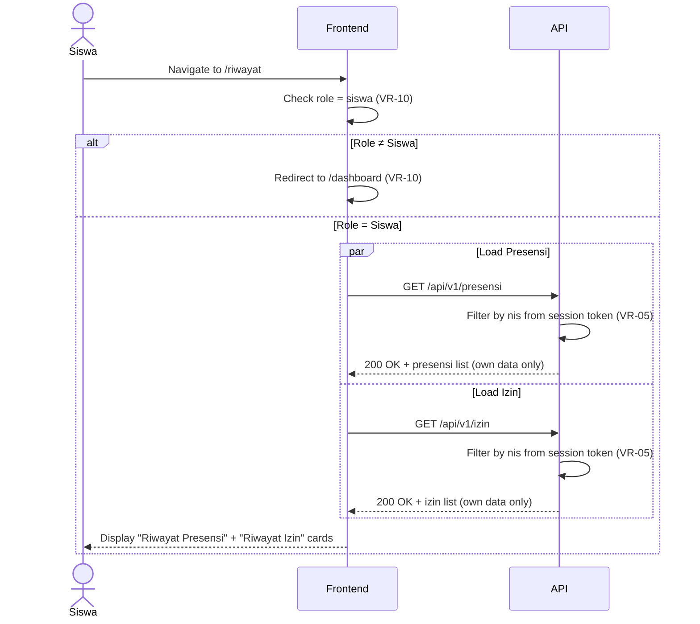

# System Logic: UC-014 Lihat Riwayat Kehadiran oleh Siswa

Document Version: v1.0
Use Case ID: UC-014
Use Case Name: Lihat Riwayat Kehadiran oleh Siswa
Status: Draft
Last Updated: 2026-07-17
Author: System Analyst AI

---

Note: This API contract is provided as a structural reference for future backend implementation. The current prototype uses localStorage / React Context for data persistence and session state (per srs.md Section 9, item 11) — there is no live backend API in this phase.

---

## 1. Overview

This document defines the system logic for Siswa viewing their own attendance history (F-18, srs.md Section 4.6) and izin status (F-10, srs.md Section 4.2). The page at `/riwayat` displays two separate cards — "Riwayat Presensi" and "Riwayat Izin" — each showing data belonging exclusively to the logged-in student (VR-05). The system reuses existing `GET /api/v1/presensi` and `GET /api/v1/izin` endpoints, filtered server-side by the student's `nis` from the session token. No new endpoint is created.

---

## 2. Sequence Diagram



---

## 3. API Contract

### 3.1 GET /api/v1/presensi (filtered by own nis)

Retrieve the logged-in student's presensi records. Reuses the existing endpoint from the Endpoint Registry (index.md). Server filters by `nis` derived from the session token (VR-05).

**Request Headers:**

| Header | Value |
| --- | --- |
| Content-Type | application/json |
| Authorization | Bearer \<session_token\> |

**Query Parameters (optional):**

| Parameter | Type | Description |
| --- | --- | --- |
| tanggalMulai | string (ISO date) | Filter tanggal awal |
| tanggalAkhir | string (ISO date) | Filter tanggal akhir |
| idKelas | string | Filter kelas (ignored for Siswa — server overrides with own kelas) |

**Success Response (200 OK):**

```json
{
  "success": true,
  "data": {
    "presensi": [
      {
        "idPresensi": "PRS-001",
        "nis": "2024001",
        "tanggal": "2026-07-16",
        "jamMulai": "07:00",
        "jamSelesai": "08:30",
        "mataPelajaran": "Matematika",
        "namaGuru": "Pak Budi",
        "statusHadir": true,
        "statusManual": "hadir"
      },
      {
        "idPresensi": "PRS-002",
        "nis": "2024001",
        "tanggal": "2026-07-16",
        "jamMulai": "08:30",
        "jamSelesai": "10:00",
        "mataPelajaran": "Bahasa Indonesia",
        "namaGuru": "Bu Ani",
        "statusHadir": false,
        "statusManual": "tidak_hadir"
      }
    ],
    "total": 45
  },
  "message": "Success"
}
```

**Error Response (401 Unauthorized):**

```json
{
  "success": false,
  "data": null,
  "message": "Token tidak valid atau telah kedaluwarsa",
  "errors": []
}
```

### 3.2 GET /api/v1/izin (filtered by own nis)

Retrieve the logged-in student's izin records. Reuses the existing endpoint from the Endpoint Registry (index.md). Server filters by `nis` derived from the session token (VR-05).

**Request Headers:**

| Header | Value |
| --- | --- |
| Content-Type | application/json |
| Authorization | Bearer \<session_token\> |

**Query Parameters (optional):**

| Parameter | Type | Description |
| --- | --- | --- |
| statusIzin | string | Filter status: `menunggu`, `disetujui`, `ditolak` |
| jenisIzin | string | Filter jenis: `sakit`, `izin`, `lainnya` |

**Success Response (200 OK):**

```json
{
  "success": true,
  "data": {
    "izin": [
      {
        "idIzin": "IZN-001",
        "nis": "2024001",
        "tanggalIzin": "2026-07-15",
        "jenisIzin": "sakit",
        "statusIzin": "disetujui",
        "keterangan": "Sakit flu, surat dokter terlampir",
        "buktiPendukung": "surat_dokter.pdf"
      },
      {
        "idIzin": "IZN-002",
        "nis": "2024001",
        "tanggalIzin": "2026-07-10",
        "jenisIzin": "izin",
        "statusIzin": "menunggu",
        "keterangan": "Keperluan keluarga",
        "buktiPendukung": "(tanpa file)"
      }
    ],
    "total": 2
  },
  "message": "Success"
}
```

**Error Response (401 Unauthorized):**

```json
{
  "success": false,
  "data": null,
  "message": "Token tidak valid atau telah kedaluwarsa",
  "errors": []
}
```

---

## 4. Data Flow

| Step | Input | Process | Output |
| --- | --- | --- | --- |
| 1 | Student navigates to `/riwayat` | Frontend checks role = siswa (VR-10) | Role validation |
| 2 | GET /api/v1/presensi | Server filters by nis from session token (VR-05) | Own presensi records |
| 3 | GET /api/v1/izin | Server filters by nis from session token (VR-05) | Own izin records |
| 4 | Presensi data | Frontend renders "Riwayat Presensi" card (reverse-chronological) | Presensi table (Tanggal, Jam, Mapel, Guru, Status) |
| 5 | Izin data | Frontend renders "Riwayat Izin" card (reverse-chronological) | Izin table (Tanggal, Jenis, Status, Keterangan) |
| 6 | Both cards | Empty state shown if no data exists | "Belum ada data presensi" / "Belum ada pengajuan izin" |

---

## 5. Security Rules / Business Rule Enforcement

| Rule | Description |
| --- | --- |
| F-18 | Melihat riwayat kehadiran sendiri (srs.md Section 4.6): Siswa dapat melihat riwayat dan rekapitulasi kehadiran miliknya sendiri. |
| F-10 | Melihat status izin (srs.md Section 4.2): Siswa dapat melihat status terkini dari pengajuan izin yang telah diajukan. |
| VR-05 | Akses Data Siswa: Siswa hanya dapat melihat data miliknya sendiri. Server wajib memfilter berdasarkan `nis` dari session token — bukan dari parameter request. |
| VR-10 | Akses Terkunci Peran: Hanya Siswa yang dapat mengakses `/riwayat`. Guru Mapel, Wali Kelas, dan Admin di-redirect ke `/dashboard`. |
| No Alfa | Tidak ada status "Alfa" dalam data model. Status presensi menggunakan `statusHadir` (boolean) dan `statusManual` (`hadir`/`tidak_hadir`/`sakit`/`izin`). Status izin menggunakan `statusIzin` (`menunggu`/`disetujui`/`ditolak`). |

---

## 6. Traceability

| User Flow | Requirement | API Endpoint |
| --- | --- | --- |
| userflow_uc_014.md | F-18 (srs.md Section 4.6), F-10 (srs.md Section 4.2), VR-05, VR-10 | GET /api/v1/presensi, GET /api/v1/izin |
